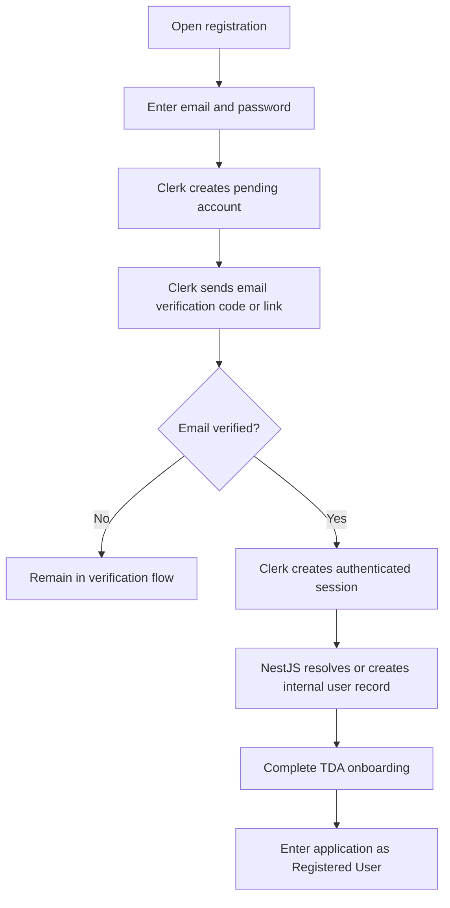
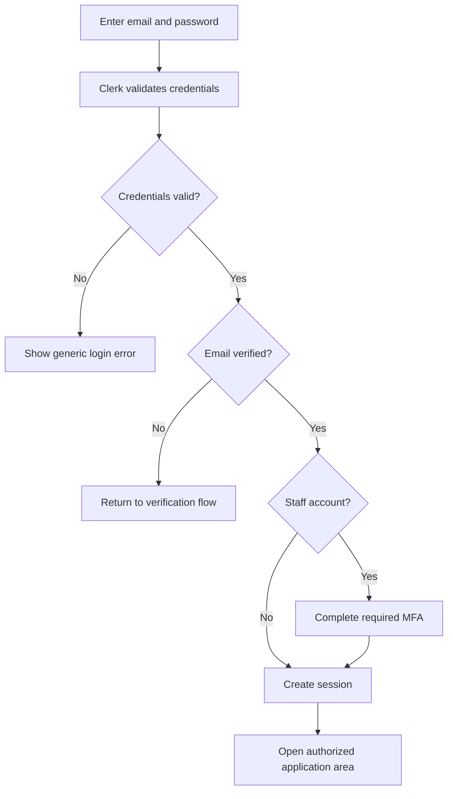
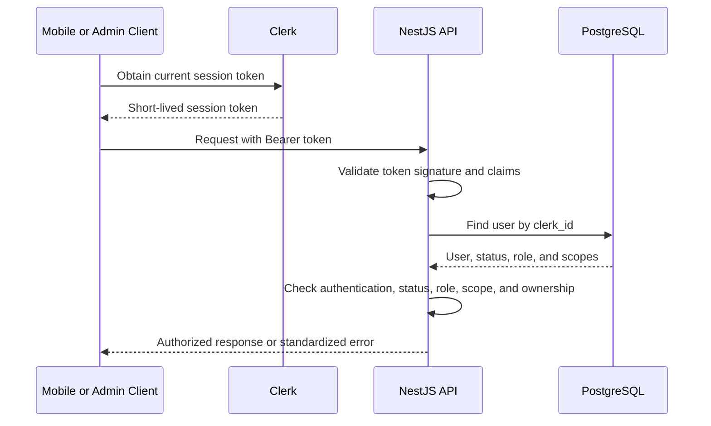
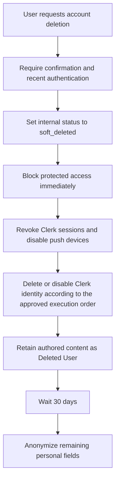

# Authentication and Authorization Architecture

## Status

- **Document type:** Authentication and authorization design
- **Scope:** TDA Version 1 / MVP
- **Authentication provider:** Clerk
- **Clients:** React Native mobile application and protected administrative web application
- **Backend:** NestJS API
- **Authorization source of truth:** PostgreSQL through Drizzle ORM

## 1. Objective

This document defines how TDA will authenticate users through Clerk and authorize actions through the NestJS API.

It covers:

- User registration and login
- Email verification and password recovery
- Session and token handling
- Authenticated API requests
- Backend token validation
- Synchronization between Clerk and the internal `users` table
- Staff roles and assignment scopes
- Protected mobile screens, administrative routes, and API endpoints
- Account deletion
- Authentication and authorization errors
- Additional security requirements for staff accounts

The administrative web application and the mobile application must communicate with PostgreSQL only through the NestJS API. Neither client may connect directly to the database.

---

# 2. System Responsibilities

## Clerk

Clerk is responsible for:

- Email-and-password registration
- Email verification
- Login
- Password recovery and password changes
- Session creation and management
- Session-token issuance
- Multi-factor authentication for staff accounts
- Session revocation
- Authentication-related security controls

## NestJS API

NestJS is responsible for:

- Validating Clerk session tokens
- Resolving the authenticated user to the internal `users` record
- Checking account status
- Enforcing roles and assignment scopes
- Enforcing resource ownership
- Protecting all non-public endpoints
- Returning consistent authentication and authorization errors
- Recording security-sensitive staff actions

## PostgreSQL

PostgreSQL is the source of truth for application authorization and TDA-owned user data, including:

- Internal user ID
- Clerk user ID reference
- Username and TDA profile fields
- Account status
- Staff role
- Moderator and Editor assignment scopes
- User preferences
- Favorites
- Community memberships
- Moderation and audit records

Passwords, password hashes, verification codes, MFA secrets, and Clerk session tokens must not be stored in PostgreSQL.

---

# 3. Account Types and Final Role Model

TDA uses one account per person.

## Public account types

### Guest

A Guest is not authenticated and does not have a `users` record.

Guests may view public sports information, feeds, posts, schedules, scores, public entity pages, and public communities.

### Registered User

Every person who completes public registration begins as a Registered User.

Registered Users may use personal and community features such as favorites, notifications, likes, comments, reports, and community membership.

## Staff roles

A staff account may have only one of the following roles at a time:

- `moderator`
- `editor`
- `administrator`

Registered-user capabilities are included automatically and are not stored as an additional staff role.

### Moderator

A Moderator may review reports and moderate comments or messages only within assigned communities.

### Editor

An Editor may publish official content and manage operational sports data only within assigned sports, leagues, teams, or other approved sports-entity scopes.

### Administrator

An Administrator has platform-wide administrative authority, subject to security and conflict-of-interest rules.

Administrators may assign or remove Moderator and Editor roles and their scopes. Administrator-role changes require a separately restricted process and may not be self-approved.

## Role-combination rule

The following combinations are prohibited on the same account:

- Moderator and Editor
- Moderator and Administrator
- Editor and Administrator

When a staff member changes responsibilities, the previous staff role must be removed before the new role becomes active.

---

# 4. Registration Flow

Public registration is available only for creating a Registered User account.

Staff roles cannot be selected during registration.



## Registration requirements

- Email and password are the Version 1 authentication method.
- Email verification is mandatory.
- A user may not complete protected onboarding actions until the email is verified.
- Password requirements are configured in Clerk.
- Duplicate-email and invalid-password errors are handled through Clerk and presented with user-friendly Spanish messages.
- The initial public role is always Registered User.
- Staff access is granted only after registration through an authorized administrative process.

---

# 5. Login and Password-Recovery Flows

## Login



## Password recovery

- The user starts password recovery from the login screen.
- Clerk verifies account ownership through the configured email recovery flow.
- Clerk allows the user to set a new password.
- TDA never receives or stores the password or recovery code.
- Existing sessions should be reviewed or revoked according to the selected Clerk security configuration after a password reset.

## Password change

An authenticated user may change the password through a Clerk-managed account-security flow. Sensitive credential changes may require recent authentication.

---

# 6. Session Strategy

## General behavior

- Multiple active sessions and devices are allowed.
- A normal logout ends only the current session.
- A future “Log out of all devices” action may revoke all active sessions.
- Each mobile device maintains its own Clerk session and push-device record.
- Staff-role or scope changes must take effect without waiting for a long-lived client session to expire.

## Session tokens

- Clerk issues short-lived session tokens.
- The mobile application sends the current token in the `Authorization` header using the Bearer scheme.
- The administrative web application sends the current Clerk session token through the supported Clerk web-session mechanism.
- Clients must request or refresh the current token through the Clerk SDK instead of storing a permanent token.
- Session tokens must never be written to application logs, analytics events, URLs, or PostgreSQL.

## Logout

When a user logs out from a mobile device:

1. Clerk ends the current session.
2. The mobile application clears local authenticated state.
3. The related `push_devices` record is disabled or disassociated from the session as appropriate.
4. Other active devices remain signed in.

## Suspensions and role changes

- A suspended or deleted internal account must be denied access even if the Clerk session token is still cryptographically valid.
- Role and scope authorization must be evaluated against PostgreSQL on protected requests.
- Security-sensitive staff changes should revoke or force reevaluation of active sessions.

---

# 7. Authenticated API-Request Flow



Every protected request must pass the following checks:

1. A session token is present.
2. The token is valid and unexpired.
3. The token was issued by the expected Clerk instance.
4. The token is intended for an approved TDA client or authorized party.
5. The token identifies a Clerk user.
6. A matching internal `users` record exists or can be safely reconciled.
7. The internal account status is `active`.
8. The required role is present.
9. The staff member is assigned to the required scope when applicable.
10. The authenticated user owns the resource when ownership is required.
11. Any required recent authentication or MFA condition is satisfied.

Authentication proves identity. It does not, by itself, grant permission to perform a staff action.

---

# 8. Backend Token Validation

NestJS will use a global or reusable authentication guard based on the Clerk Backend SDK.

The guard must:

- Read the Bearer token from the `Authorization` header or the supported Clerk web-session mechanism.
- Validate the signature using Clerk’s published verification keys or configured JWT public key.
- Validate expiration and not-before claims.
- Validate the Clerk issuer.
- Validate the expected audience when configured.
- Validate approved authorized parties for the mobile and administrative clients.
- Extract the Clerk user ID from the verified token subject.
- Reject missing, malformed, expired, or untrusted tokens with `401 Unauthorized`.

After token validation, a second authorization layer must load the internal user and enforce status, role, scope, and ownership.

## Recommended NestJS authorization components

- `ClerkAuthGuard`: validates the Clerk session token and attaches the authenticated Clerk identity to the request.
- `ActiveUserGuard`: resolves the internal user and verifies that the account is active.
- `RolesGuard`: verifies the required staff role.
- `ScopeGuard`: verifies assigned community or sports-entity scope.
- `OwnershipGuard` or service-level ownership check: protects user-owned records.
- Route decorators such as `@Public()`, `@Roles()`, and `@Scopes()` to declare requirements clearly.

Database authorization remains authoritative. Hiding a button or screen in the client is not a security control.

---

# 9. Clerk-to-PostgreSQL User Synchronization

## Primary mechanism: Clerk webhooks

NestJS will expose a dedicated Clerk webhook endpoint.

The endpoint must:

- Verify the webhook signature before processing the event.
- Be idempotent so repeated events do not create duplicate users.
- Process supported user lifecycle events.
- Record failures for retry or reconciliation.
- Never trust an unverified webhook payload.

## Supported synchronization events

### User created

Create or reconcile the internal `users` record using the Clerk user ID.

### User updated

Update only Clerk-owned identity fields that TDA has explicitly chosen to mirror, such as the verified primary email or profile image.

### User deleted

Reconcile the internal account with TDA’s approved deletion policy. A Clerk deletion event must not automatically hard-delete moderation-sensitive or authored records.

## First-request fallback

Webhook synchronization is not guaranteed to be instantaneous. Therefore, after validating a request, NestJS must attempt a safe reconciliation when the Clerk identity exists but the internal user record is missing.

The fallback must:

1. Confirm the token is valid.
2. Retrieve only the Clerk data required to create the internal record.
3. Insert the user idempotently using the unique `clerk_id` constraint.
4. Assign no staff role.
5. Continue the request only after the internal record is valid.

## Data ownership

| Data | Source of truth |
|---|---|
| Password and password security | Clerk |
| Email verification state | Clerk |
| Authentication methods and MFA | Clerk |
| Sessions and session revocation | Clerk |
| `clerk_id` | Clerk |
| Internal `users.id` | PostgreSQL |
| TDA username and application profile | PostgreSQL |
| Account status in TDA | PostgreSQL |
| Staff role and assignment scopes | PostgreSQL |
| Favorites, preferences, communities, and reports | PostgreSQL |

---

# 10. Role Storage and Synchronization

## Source of truth

PostgreSQL is the only authoritative source for TDA roles and assignment scopes.

Roles must not be trusted from editable client data or user-controlled Clerk metadata.

## Recommended storage model

Because one account may have only one staff role, the schema should enforce that rule through either:

- A nullable `staff_role` field on `users`, or
- A `user_roles` table with a unique constraint on `user_id`.

The final allowed role values are:

- `moderator`
- `editor`
- `administrator`

## Assignment scopes

The authorization model requires explicit scope records.

Recommended scope tables include:

- `moderator_community_assignments`
- `editor_sport_assignments`
- `editor_league_assignments`
- `editor_team_assignments`

Each assignment should store:

- Staff user ID
- Assigned entity ID
- Assigning Administrator
- Assignment timestamp
- Optional revocation timestamp

Administrators do not require entity-scope rows because their approved access is platform-wide.

## Role-change behavior

When a role or scope changes:

1. PostgreSQL is updated in a transaction.
2. An audit record is created.
3. Cached authorization data is invalidated.
4. Active staff sessions are reevaluated or revoked when the change reduces access.
5. The user receives only the permissions associated with the new role and scope.

No user may assign, approve, or expand their own role or scope.

---

# 11. Route and Endpoint Protection

## Public routes

Public routes do not require authentication and should be read-only.

Examples:

- Public Home and Descubre feeds
- Published posts and articles
- Sports, leagues, teams, and athlete pages
- Public schedules and verified final scores
- Public game-detail pages
- Public search
- Public community discovery and read-only community information

## Authenticated-user routes

These routes require a valid session and active internal account.

Examples:

- Onboarding
- Favorites
- Notification preferences
- Likes
- Comments and replies
- Joining or leaving communities
- Sending eligible community messages
- Reports
- Profile and account settings
- Account-deletion request

## Ownership-protected routes

Examples:

- Edit the user’s own profile
- Delete the user’s own eligible comment
- Edit or remove the user’s own eligible community message
- View the user’s own report status

## Moderator routes

These routes require:

- Active `moderator` role
- MFA-compliant staff session
- Assignment to the affected community

Examples:

- Review assigned community reports
- Hide or restore comments or messages in assigned communities
- Warn or temporarily mute users in assigned communities
- View moderation history within assigned communities

## Editor routes

These routes require:

- Active `editor` role
- MFA-compliant staff session
- Assignment to the affected sport, league, team, or approved entity scope

Examples:

- Create and edit official-content drafts
- Publish or schedule official content within scope
- Manage games, schedules, scores, descriptions, and approved media within scope

## Administrator routes

These routes require:

- Active `administrator` role
- MFA-compliant staff session
- Recent authentication for especially sensitive actions

Examples:

- Manage core sports entities and integrations
- Create or manage communities
- Review platform-wide reports and appeals
- Suspend or reactivate accounts
- Assign or remove Moderator and Editor roles
- Define staff scopes
- Process account-deletion operations
- Access authorized audit and security records

## Example endpoint matrix

| Endpoint pattern | Access requirement |
|---|---|
| `GET /posts` | Public |
| `GET /games` | Public |
| `GET /teams/:id` | Public |
| `POST /favorites` | Authenticated user |
| `DELETE /comments/:id` | Owner, assigned Moderator, or Administrator |
| `POST /communities/:id/messages` | Active authenticated community member |
| `GET /moderation/reports` | Assigned Moderator or Administrator |
| `POST /admin/posts` | Assigned Editor or Administrator |
| `PATCH /admin/games/:id` | Assigned Editor or Administrator |
| `PATCH /admin/scores/:id` | Assigned Editor or Administrator |
| `PATCH /admin/users/:id/suspend` | Administrator |
| `PATCH /admin/users/:id/role` | Administrator, subject to restricted role rules |

The final endpoint names may change during API design, but the authorization categories are required.

---

# 12. Administrative Web-Application Authentication

The exact frontend framework for the administrative web application is outside this issue. Regardless of framework, the following rules apply:

- The dashboard uses Clerk’s supported web SDK for the selected framework.
- There is no public staff-registration option.
- A person first creates a normal Registered User account or receives an authorized staff-account setup.
- Staff access is granted only through an approved role-assignment process.
- The dashboard checks authentication before rendering protected routes.
- NestJS independently revalidates every API request and never trusts the dashboard’s client-side checks.
- Staff users must complete MFA before accessing staff tools.
- Sensitive Administrator actions require recent authentication.
- The dashboard must not receive Clerk secret keys, database credentials, or unrestricted backend tokens.

---

# 13. Account-Deletion Behavior

TDA uses immediate soft deletion followed by delayed anonymization.



## Immediate actions

- Require explicit confirmation.
- Require recent identity verification.
- Set `users.status = 'soft_deleted'` and record `deleted_at`.
- Deny all protected actions immediately.
- Revoke active Clerk sessions.
- Disable active push-device records.
- Remove active staff role and scope assignments.
- Prevent the account from being used as a moderation or publishing identity.

## Retained records

Posts, comments, messages, reports, moderation records, and required audit evidence may remain linked to the retained internal user ID.

Public presentation must replace the deleted identity with **Deleted User**.

## Thirty-day anonymization

After 30 days, the cleanup process clears the approved personal fields, including:

- Clerk user ID reference
- Email
- Username
- First and last name
- Profile photo URL

The internal UUID, lifecycle timestamps, content relationships, and required moderation evidence remain.

## Failure handling

Deletion must be idempotent and resumable.

If one external or internal step fails:

- The account remains blocked internally.
- The failed step is recorded.
- The process retries safely.
- The user is not restored automatically because an external deletion step failed.

Account deletion is separate from suspension and must not be used as a moderation shortcut.

---

# 14. Authentication and Authorization Error Behavior

The API returns a consistent error structure:

```json
{
  "statusCode": 401,
  "code": "AUTH_TOKEN_INVALID",
  "message": "Tu sesión no es válida. Inicia sesión nuevamente."
}
```

Internal logs may contain diagnostic details, but user-facing responses must not expose tokens, private records, role-assignment details, stack traces, or Clerk secrets.

| Situation | HTTP status | Suggested code | Expected client behavior |
|---|---:|---|---|
| Missing token | `401` | `AUTH_TOKEN_MISSING` | Open login when the action requires an account |
| Invalid or expired token | `401` | `AUTH_TOKEN_INVALID` | Attempt normal Clerk refresh; otherwise require login |
| Email not verified | `403` | `AUTH_EMAIL_UNVERIFIED` | Return to email-verification flow |
| Internal user temporarily missing | `503` after failed reconciliation | `AUTH_USER_SYNC_PENDING` | Show retry message; do not create duplicate accounts |
| Suspended account | `403` | `ACCOUNT_SUSPENDED` | Block protected use and show support guidance |
| Soft-deleted account | `403` | `ACCOUNT_DELETED` | End local session and block access |
| Insufficient role | `403` | `AUTH_ROLE_REQUIRED` | Show generic no-permission message |
| Outside assigned scope | `403` | `AUTH_SCOPE_REQUIRED` | Show generic no-permission message |
| Resource not found | `404` | `RESOURCE_NOT_FOUND` | Show normal not-found state |
| Duplicate username or conflicting record | `409` | `RESOURCE_CONFLICT` | Ask user to choose a different value |
| Invalid request fields | `422` | `VALIDATION_FAILED` | Highlight valid field-level errors |
| Clerk temporarily unavailable | `503` | `AUTH_PROVIDER_UNAVAILABLE` | Preserve safe state and allow retry |

Login errors should avoid confirming whether a particular email address has an account when that information would create an enumeration risk.

---

# 15. Security Expectations for Staff Accounts

## Required controls

- MFA is mandatory for Moderator, Editor, and Administrator accounts.
- Staff registration is not public.
- Staff-role and scope changes require an authenticated Administrator and an audit record.
- Administrator-role changes use a separately restricted approval process.
- No user may approve their own role, scope, report, appeal, or account action.
- Sensitive Administrator actions require recent authentication.
- Staff access is denied when the internal account is suspended, deleted, or missing the required role or scope.
- The backend enforces all staff permissions even when the administrative interface hides unavailable controls.
- Clerk secret keys and webhook signing secrets remain server-side only.
- Authentication tokens and sensitive credentials must be redacted from logs.
- Rate limiting and abuse protection should be applied to login-adjacent, webhook, and sensitive administrative endpoints.
- Webhook events must be signature-verified, idempotent, and replay-safe.
- Administrative actions must use least privilege.

## Required audit events

The system records at least:

- Staff-role assignment and removal
- Scope assignment and removal
- Publication and material editing of official content
- Sports-data changes
- Moderation actions
- Account suspensions and reactivations
- Account-deletion processing
- Access to restricted user information
- Security-sensitive configuration changes

Each audit record identifies the actor, action, target, scope, reason, timestamp, and result.

---

# 16. Required Database-Schema Alignment

The approved authentication model requires a small alignment with the current initial database design.

## Required changes

1. Replace the cumulative role names with:
   - `moderator`
   - `editor`
   - `administrator`

2. Enforce only one staff role per user.

3. Add explicit assignment-scope tables for Moderators and Editors.

4. Preserve PostgreSQL as the authorization source of truth.

5. Ensure that account deletion removes active role and scope assignments immediately while retaining required audit evidence.

These changes align authentication, authorization, the roles-and-permissions document, and backend enforcement before implementation begins.

---

# 17. Implementation Checklist

## Mobile application

-  Configure Clerk for email-and-password authentication.
-  Require email verification.
-  Implement registration, login, verification, password recovery, and logout screens.
-  Send the current Clerk session token to NestJS.
-  Handle `401`, `403`, and provider-unavailable states consistently.
-  Register and disable push-device tokens as sessions change.

## Administrative web application

-  Integrate the Clerk web SDK selected for the final frontend framework.
-  Protect all staff routes.
-  Require MFA for all staff accounts.
-  Hide controls outside the current role and scope without relying on hiding as security.
-  Require recent authentication for sensitive Administrator actions.

## NestJS API

-  Implement the Clerk authentication guard.
-  Implement active-user, role, scope, and ownership authorization.
-  Add webhook signature verification and idempotency.
-  Add first-request user reconciliation.
-  Standardize authentication and authorization errors.
-  Add role, scope, moderation, and account-action audit records.
-  Add account-deletion orchestration and retry handling.

## PostgreSQL and Drizzle ORM

-  Enforce unique `clerk_id` for active identities.
-  Enforce one staff role per account.
-  Add Moderator and Editor scope-assignment tables.
-  Preserve the approved soft-deletion and 30-day anonymization policy.
-  Add constraints and indexes required for role and scope checks.

---

# 18. Deliverables Completed

This design provides:

- Documented mobile and administrator authentication flows
- A defined session- and token-handling strategy
- A defined backend token-validation process
- A strategy for connecting Clerk identities to internal database users
- A defined role-storage and synchronization strategy
- Documented frontend-route and backend-endpoint protection
- An account-deletion process covering Clerk and internal data
- Defined authentication and authorization error behavior
- Additional security expectations for administrative accounts

---

# 19. Final Decision

TDA Version 1 will use Clerk for authentication and PostgreSQL for application authorization.

Users will register with email and password, verify their email, and may use multiple devices. The mobile application and administrative web application will send Clerk session tokens to the NestJS API, which will independently validate identity and enforce account status, role, assignment scope, ownership, MFA-related requirements, and recent-authentication requirements.

Public registration creates only Registered Users. Staff access is granted through controlled administrative processes. Each staff account may hold only one role: Moderator, Editor, or Administrator. Moderators and Editors are limited to assigned scopes; Administrators have approved platform-wide authority.

Clerk webhooks will provide the primary user-synchronization mechanism, supported by safe first-request reconciliation. Account deletion will block access immediately, revoke sessions, retain necessary authored and moderation records under **Deleted User**, and anonymize approved personal fields after 30 days.
