# Design Initial Database Schema and Relationships

## Status

- **Document type:** Initial relational database design
- **Target database:** PostgreSQL
- **ORM:** Drizzle ORM
- **Scope:** Version 1 / MVP
- **Source:** Approved TDA Product Data Requirements

## 1. Objective

This document converts the approved MVP data requirements into an initial relational database design for PostgreSQL and Drizzle ORM. It defines the core tables, primary and foreign keys, one-to-one, one-to-many, and many-to-many relationships, lifecycle fields, indexing requirements, PostgreSQL Full-Text Search support, and unresolved database decisions.

The design prioritizes:

- Referential integrity through PostgreSQL foreign keys and constraints.
- Explicit lifecycle and moderation states.
- Soft deletion for user-generated or moderation-sensitive records.
- Normalized many-to-many relationships.
- Compatibility with Drizzle ORM migrations and schema definitions.
- A structure that can expand after the MVP without requiring a complete redesign.

## 2. Naming and Type Conventions

| Area | Convention |
|---|---|
| Tables | `snake_case`, plural names |
| Columns | `snake_case` |
| Primary keys | `id UUID PRIMARY KEY DEFAULT gen_random_uuid()` unless a composite key is more appropriate |
| Foreign keys | `<entity>_id` |
| Timestamps | `TIMESTAMPTZ` stored in UTC |
| Created timestamps | `created_at TIMESTAMPTZ NOT NULL DEFAULT now()` |
| Updated timestamps | `updated_at TIMESTAMPTZ NOT NULL DEFAULT now()` |
| Soft deletion | Nullable `deleted_at TIMESTAMPTZ` |
| Archived records | Nullable `archived_at TIMESTAMPTZ` |
| User-facing unique text | Case-insensitive uniqueness using `citext` or a unique index on `lower(column)` |
| Media | Store object-storage URLs and metadata, not file bytes, in PostgreSQL |
| Status values | PostgreSQL enums mapped through Drizzle `pgEnum` |

The `pgcrypto` extension is required for `gen_random_uuid()`. The `citext` extension is recommended for case-insensitive email, username, and slug comparisons.

## 3. PostgreSQL Enum Types

The following enums should be created through Drizzle `pgEnum` definitions.

| Enum | Values |
|---|---|
| `user_status` | `active`, `suspended`, `soft_deleted` |
| `sport_status` | `draft`, `active`, `inactive`, `archived` |
| `league_status` | `upcoming`, `ongoing`, `finished`, `archived` |
| `team_status` | `active`, `inactive`, `archived` |
| `athlete_status` | `active`, `inactive`, `archived` |
| `game_status` | `scheduled`, `in_progress`, `finished`, `postponed`, `canceled` |
| `score_status` | `pending`, `updated`, `final` |
| `post_status` | `draft`, `published`, `hidden`, `soft_deleted` |
| `community_status` | `active`, `restricted`, `archived` |
| `membership_role` | `member`, `moderator`, `admin` |
| `membership_status` | `active`, `muted`, `banned`, `left` |
| `notification_type` | `score_update`, `official_announcement`, `system` |
| `report_status` | `pending`, `in_review`, `resolved`, `dismissed` |
| `report_entity_type` | `post`, `message`, `user` |
| `media_type` | `image`, `video` |

## 4. Core Table Design

### 4.1 `users`

Represents registered platform users, including fans, community members, moderators, and administrators.

| Column | Type | Null | Constraints / Notes |
|---|---|---:|---|
| `id` | `uuid` | No | Primary key |
| `clerk_id` | `varchar(255)` | No | Unique external authentication reference |
| `email` | `citext` | No | Unique |
| `username` | `citext` | No | Unique |
| `first_name` | `varchar(100)` | No |  |
| `last_name` | `varchar(100)` | No |  |
| `profile_photo_url` | `text` | Yes | Object-storage URL |
| `status` | `user_status` | No | Default `active` |
| `suspended_at` | `timestamptz` | Yes | Set when account is suspended |
| `deleted_at` | `timestamptz` | Yes | Soft-delete timestamp |
| `created_at` | `timestamptz` | No | Registration timestamp |
| `updated_at` | `timestamptz` | No |  |

### 4.2 `sports`

Catalogs the controlled sports supported by the platform.

| Column | Type | Null | Constraints / Notes |
|---|---|---:|---|
| `id` | `uuid` | No | Primary key |
| `name` | `citext` | No | Unique |
| `description` | `text` | Yes |  |
| `icon_url` | `text` | No | Required representative icon |
| `banner_url` | `text` | Yes | Optional cover image |
| `status` | `sport_status` | No | Default `draft` |
| `archived_at` | `timestamptz` | Yes |  |
| `created_at` | `timestamptz` | No |  |
| `updated_at` | `timestamptz` | No |  |

### 4.3 `leagues`

Represents a verified league or championship for a specific sport and season.

| Column | Type | Null | Constraints / Notes |
|---|---|---:|---|
| `id` | `uuid` | No | Primary key |
| `sport_id` | `uuid` | No | Foreign key to `sports.id` |
| `name` | `varchar(200)` | No |  |
| `season_label` | `varchar(50)` | No | Supports values such as `2026` or `2026-27` |
| `region` | `varchar(150)` | Yes | Region or category |
| `logo_url` | `text` | No |  |
| `description` | `text` | Yes |  |
| `status` | `league_status` | No | Default `upcoming` |
| `archived_at` | `timestamptz` | Yes |  |
| `created_at` | `timestamptz` | No |  |
| `updated_at` | `timestamptz` | No |  |

**Unique constraint:** `(sport_id, name, season_label)`.

### 4.4 `teams`

Stores the stable identity and public profile of a team or club.

| Column | Type | Null | Constraints / Notes |
|---|---|---:|---|
| `id` | `uuid` | No | Primary key |
| `official_name` | `varchar(200)` | No |  |
| `short_name` | `varchar(50)` | Yes | Abbreviation or short name |
| `city` | `varchar(150)` | No | Home city or location |
| `home_venue` | `varchar(200)` | Yes |  |
| `logo_url` | `text` | No |  |
| `status` | `team_status` | No | Default `active` |
| `archived_at` | `timestamptz` | Yes |  |
| `created_at` | `timestamptz` | No |  |
| `updated_at` | `timestamptz` | No |  |

A team is connected to one or more league-season records through `league_teams` instead of storing a single `league_id` directly on the team. This avoids duplicating a team whenever it participates in a new season or competition.

### 4.5 `league_teams`

Many-to-many junction table connecting teams to leagues.

| Column | Type | Null | Constraints / Notes |
|---|---|---:|---|
| `league_id` | `uuid` | No | Foreign key to `leagues.id` |
| `team_id` | `uuid` | No | Foreign key to `teams.id` |
| `joined_at` | `timestamptz` | No | Default `now()` |
| `left_at` | `timestamptz` | Yes | Optional participation end |

**Primary key:** `(league_id, team_id)`.

This table also allows a game to enforce that both participating teams belong to the selected league through composite foreign keys.

### 4.6 `athletes`

Stores the current basic athlete profile used in match rosters.

| Column | Type | Null | Constraints / Notes |
|---|---|---:|---|
| `id` | `uuid` | No | Primary key |
| `current_team_id` | `uuid` | No | Foreign key to `teams.id` |
| `first_name` | `varchar(100)` | No |  |
| `last_name` | `varchar(100)` | No |  |
| `position` | `varchar(100)` | No |  |
| `jersey_number` | `varchar(10)` | Yes | Stored as text to support non-numeric values |
| `photo_url` | `text` | Yes |  |
| `status` | `athlete_status` | No | Default `active` |
| `archived_at` | `timestamptz` | Yes |  |
| `created_at` | `timestamptz` | No |  |
| `updated_at` | `timestamptz` | No |  |

Historical roster assignments are deferred from the MVP. The current team is stored directly on the athlete.

### 4.7 `games`

Represents a scheduled sporting event between two teams.

| Column | Type | Null | Constraints / Notes |
|---|---|---:|---|
| `id` | `uuid` | No | Primary key |
| `league_id` | `uuid` | No | Foreign key to `leagues.id` |
| `home_team_id` | `uuid` | No | Foreign key to `teams.id` |
| `away_team_id` | `uuid` | No | Foreign key to `teams.id` |
| `scheduled_start_at` | `timestamptz` | No | Stored in UTC |
| `status` | `game_status` | No | Default `scheduled` |
| `venue` | `varchar(250)` | Yes |  |
| `broadcast_details` | `text` | Yes | Channel or streaming platform details |
| `cover_image_url` | `text` | Yes |  |
| `created_at` | `timestamptz` | No |  |
| `updated_at` | `timestamptz` | No |  |

**Constraints:**

- `CHECK (home_team_id <> away_team_id)`.
- Composite foreign key `(league_id, home_team_id)` references `league_teams(league_id, team_id)`.
- Composite foreign key `(league_id, away_team_id)` references `league_teams(league_id, team_id)`.
- Recommended unique constraint: `(league_id, home_team_id, away_team_id, scheduled_start_at)`.

The game record is the authoritative schedule record for MVP. A separate scheduling table is not required unless recurring fixtures, schedule revisions, or multiple time slots must be retained later.

### 4.8 `scores`

Stores the latest score state for a game.

| Column | Type | Null | Constraints / Notes |
|---|---|---:|---|
| `id` | `uuid` | No | Primary key |
| `game_id` | `uuid` | No | Unique foreign key to `games.id` |
| `home_score` | `integer` | No | Default `0`; must be non-negative |
| `away_score` | `integer` | No | Default `0`; must be non-negative |
| `period_breakdown` | `jsonb` | Yes | Flexible MVP structure for quarters, halves, sets, or periods |
| `winning_team_id` | `uuid` | Yes | Foreign key to `teams.id`; required when final and not tied |
| `status` | `score_status` | No | Default `pending` |
| `last_updated_at` | `timestamptz` | No | Default `now()` |
| `created_at` | `timestamptz` | No |  |

**Relationship:** one game has zero or one score record; one score belongs to exactly one game.

Application validation must confirm that `winning_team_id`, when present, matches either the game's home or away team. A database trigger may be added later if this rule must be enforced exclusively in PostgreSQL.

### 4.9 `posts`

Stores admin-curated updates and moderated community content.

| Column | Type | Null | Constraints / Notes |
|---|---|---:|---|
| `id` | `uuid` | No | Primary key |
| `author_user_id` | `uuid` | No | Foreign key to `users.id` |
| `content` | `text` | No |  |
| `cover_media_url` | `text` | Yes |  |
| `cover_media_type` | `media_type` | Yes | Required when `cover_media_url` is present |
| `status` | `post_status` | No | Default `draft` |
| `published_at` | `timestamptz` | Yes | Required when published |
| `hidden_at` | `timestamptz` | Yes |  |
| `deleted_at` | `timestamptz` | Yes | Soft deletion |
| `created_at` | `timestamptz` | No |  |
| `updated_at` | `timestamptz` | No |  |

A post may be connected to multiple sports-domain entities through explicit junction tables:

- `post_sports(post_id, sport_id)`
- `post_leagues(post_id, league_id)`
- `post_teams(post_id, team_id)`
- `post_athletes(post_id, athlete_id)`
- `post_games(post_id, game_id)`
- `post_communities(post_id, community_id)`

Each junction table uses a composite primary key and foreign keys with `ON DELETE CASCADE` for hard-deletion cleanup. This design preserves referential integrity and avoids an unvalidated polymorphic `entity_type + entity_id` pair.

### 4.10 `favorites`

Stores user-selected favorite sports entities and their notification preference.

| Column | Type | Null | Constraints / Notes |
|---|---|---:|---|
| `id` | `uuid` | No | Primary key |
| `user_id` | `uuid` | No | Foreign key to `users.id` |
| `sport_id` | `uuid` | Yes | Foreign key to `sports.id` |
| `league_id` | `uuid` | Yes | Foreign key to `leagues.id` |
| `team_id` | `uuid` | Yes | Foreign key to `teams.id` |
| `athlete_id` | `uuid` | Yes | Foreign key to `athletes.id` |
| `notifications_enabled` | `boolean` | No | Default `true` |
| `added_at` | `timestamptz` | No | Default `now()` |

**Check constraint:** exactly one favorite target must be non-null.

```sql
CHECK (
  num_nonnulls(sport_id, league_id, team_id, athlete_id) = 1
)
```

**Partial unique indexes:**

- `(user_id, sport_id) WHERE sport_id IS NOT NULL`
- `(user_id, league_id) WHERE league_id IS NOT NULL`
- `(user_id, team_id) WHERE team_id IS NOT NULL`
- `(user_id, athlete_id) WHERE athlete_id IS NOT NULL`

This prevents duplicate favorites while preserving valid foreign keys to every supported target type.

### 4.11 `communities`

Represents official public discussion channels created by administrators.

| Column | Type | Null | Constraints / Notes |
|---|---|---:|---|
| `id` | `uuid` | No | Primary key |
| `name` | `varchar(150)` | No |  |
| `slug` | `citext` | No | Unique |
| `description` | `text` | Yes |  |
| `guidelines` | `text` | Yes |  |
| `avatar_url` | `text` | Yes |  |
| `banner_url` | `text` | Yes |  |
| `linked_sport_id` | `uuid` | Yes | Foreign key to `sports.id` |
| `linked_league_id` | `uuid` | Yes | Foreign key to `leagues.id` |
| `linked_team_id` | `uuid` | Yes | Foreign key to `teams.id` |
| `status` | `community_status` | No | Default `active` |
| `archived_at` | `timestamptz` | Yes |  |
| `created_at` | `timestamptz` | No |  |
| `updated_at` | `timestamptz` | No |  |

**Check constraint:** zero or one linked sports-domain entity may be selected.

```sql
CHECK (
  num_nonnulls(linked_sport_id, linked_league_id, linked_team_id) <= 1
)
```

### 4.12 `community_memberships`

Many-to-many relationship between users and communities.

| Column | Type | Null | Constraints / Notes |
|---|---|---:|---|
| `community_id` | `uuid` | No | Foreign key to `communities.id` |
| `user_id` | `uuid` | No | Foreign key to `users.id` |
| `role` | `membership_role` | No | Default `member` |
| `status` | `membership_status` | No | Default `active` |
| `joined_at` | `timestamptz` | No | Default `now()` |
| `left_at` | `timestamptz` | Yes |  |
| `updated_at` | `timestamptz` | No |  |

**Primary key:** `(community_id, user_id)`.

Membership status supports moderation actions without deleting membership history.

### 4.13 `messages`

Stores text-only public messages inside communities.

| Column | Type | Null | Constraints / Notes |
|---|---|---:|---|
| `id` | `uuid` | No | Primary key |
| `community_id` | `uuid` | No | Foreign key to `communities.id` |
| `sender_user_id` | `uuid` | No | Foreign key to `users.id` |
| `message_text` | `text` | No |  |
| `sent_at` | `timestamptz` | No | Default `now()` |
| `deleted_at` | `timestamptz` | Yes | Soft deletion |

A composite foreign key from `(community_id, sender_user_id)` to `community_memberships(community_id, user_id)` is recommended. It confirms that the sender has a membership record. The application must additionally verify that the membership status is `active` and that the community is not restricted for that user.

### 4.14 `notifications`

Stores basic in-app and push notification records.

| Column | Type | Null | Constraints / Notes |
|---|---|---:|---|
| `id` | `uuid` | No | Primary key |
| `user_id` | `uuid` | No | Foreign key to `users.id` |
| `title` | `varchar(200)` | No |  |
| `message` | `text` | No |  |
| `type` | `notification_type` | No |  |
| `is_read` | `boolean` | No | Default `false` |
| `deep_link_route` | `text` | Yes | Internal app route |
| `created_at` | `timestamptz` | No | Generation timestamp |
| `read_at` | `timestamptz` | Yes |  |
| `expires_at` | `timestamptz` | Yes | Used by a purge job |

The lifecycle is represented by `is_read`, `read_at`, and eventual physical deletion after `expires_at`.

### 4.15 `reports`

Stores moderation reports submitted against a post, message, or user.

| Column | Type | Null | Constraints / Notes |
|---|---|---:|---|
| `id` | `uuid` | No | Primary key |
| `reporter_user_id` | `uuid` | No | Foreign key to `users.id` |
| `reported_entity_type` | `report_entity_type` | No |  |
| `reported_user_id` | `uuid` | Yes | Foreign key to `users.id` |
| `reported_post_id` | `uuid` | Yes | Foreign key to `posts.id` |
| `reported_message_id` | `uuid` | Yes | Foreign key to `messages.id` |
| `reason` | `text` | No |  |
| `status` | `report_status` | No | Default `pending` |
| `admin_notes` | `text` | Yes | Internal-only |
| `resolving_admin_user_id` | `uuid` | Yes | Foreign key to `users.id` |
| `created_at` | `timestamptz` | No |  |
| `updated_at` | `timestamptz` | No |  |
| `resolved_at` | `timestamptz` | Yes |  |

**Constraints:**

- Exactly one of `reported_user_id`, `reported_post_id`, or `reported_message_id` must be non-null.
- The populated foreign key must match `reported_entity_type`.
- `resolving_admin_user_id` and `resolved_at` are required when status becomes `resolved` or `dismissed`.

The second and third rules should be enforced through PostgreSQL check constraints where possible and repeated in application validation.

## 5. Relationship Summary

### One-to-One

| Parent | Child | Relationship |
|---|---|---|
| `games` | `scores` | A game has zero or one score record; a score belongs to one game |

### One-to-Many

| Parent | Child | Relationship |
|---|---|---|
| `sports` | `leagues` | One sport contains many league-season records |
| `teams` | `athletes` | One team has many currently assigned athletes |
| `leagues` | `games` | One league contains many games |
| `users` | `posts` | One user may author many posts |
| `communities` | `messages` | One community contains many messages |
| `users` | `messages` | One user may send many messages |
| `users` | `notifications` | One user receives many notifications |
| `users` | `reports` | One user may submit many reports |
| `users` | `reports` | One administrator may resolve many reports |

### Many-to-Many

| Entity A | Junction Table | Entity B |
|---|---|---|
| `leagues` | `league_teams` | `teams` |
| `users` | `community_memberships` | `communities` |
| `posts` | `post_sports` | `sports` |
| `posts` | `post_leagues` | `leagues` |
| `posts` | `post_teams` | `teams` |
| `posts` | `post_athletes` | `athletes` |
| `posts` | `post_games` | `games` |
| `posts` | `post_communities` | `communities` |
| `users` | `favorites` | Sports, leagues, teams, or athletes |

## 6. Foreign Key Delete Behavior

| Relationship | Recommended action |
|---|---|
| Sports to leagues | `ON DELETE RESTRICT` |
| Leagues/teams to `league_teams` | `ON DELETE CASCADE` for hard-deletion cleanup |
| Games to scores | `ON DELETE CASCADE` |
| Parent records to post junction tables | `ON DELETE CASCADE` |
| Users to favorites | `ON DELETE CASCADE` after permanent user purge |
| Favorite targets to favorites | `ON DELETE CASCADE` |
| Communities/users to memberships | `ON DELETE CASCADE` after permanent purge |
| Users to authored posts/messages/reports | `ON DELETE RESTRICT`; use soft deletion or anonymization |
| Communities to messages | `ON DELETE RESTRICT`; archive communities instead |
| Reported entities to reports | `ON DELETE RESTRICT` to preserve moderation evidence |
| Users to notifications | `ON DELETE CASCADE` after permanent purge |

The MVP should avoid hard deletion of sports, leagues, teams, athletes, communities, posts, messages, and reported users while dependent records exist. Lifecycle state changes are preferred.

## 7. Timestamp and Lifecycle Requirements

### Required on most mutable tables

- `created_at`
- `updated_at`

### Entity-specific lifecycle fields

| Table | Lifecycle fields |
|---|---|
| `users` | `status`, `suspended_at`, `deleted_at` |
| `sports` | `status`, `archived_at` |
| `leagues` | `status`, `archived_at` |
| `teams` | `status`, `archived_at` |
| `athletes` | `status`, `archived_at` |
| `games` | `status`, `scheduled_start_at` |
| `scores` | `status`, `last_updated_at` |
| `posts` | `status`, `published_at`, `hidden_at`, `deleted_at` |
| `communities` | `status`, `archived_at` |
| `community_memberships` | `status`, `joined_at`, `left_at` |
| `messages` | `sent_at`, `deleted_at` |
| `notifications` | `is_read`, `read_at`, `expires_at` |
| `reports` | `status`, `created_at`, `resolved_at` |

`updated_at` should be maintained in application code or through a PostgreSQL trigger. Drizzle does not automatically update this field unless the application explicitly sets it.

## 8. Initial Indexing Requirements

PostgreSQL automatically indexes primary keys and unique constraints. Additional indexes are required for foreign keys, frequent filters, feed ordering, and moderation workflows.

### Identity and lookup indexes

- Unique index on `users.clerk_id`.
- Unique case-insensitive indexes on `users.email` and `users.username`.
- Unique case-insensitive index on `communities.slug`.
- Unique index on `sports.name`.
- Unique composite index on `leagues(sport_id, name, season_label)`.

### Foreign-key and relationship indexes

- Index every non-primary-key foreign key.
- `leagues(sport_id)`.
- `athletes(current_team_id)`.
- `games(league_id)`, `games(home_team_id)`, and `games(away_team_id)`.
- `posts(author_user_id)`.
- Every post junction table should have a reverse index on its target ID because its primary key begins with `post_id`.
- `favorites(user_id)` and partial target indexes.
- `messages(community_id, sent_at DESC)`.
- `notifications(user_id, is_read, created_at DESC)`.
- `reports(status, created_at ASC)`.

### Schedule and feed indexes

- `games(status, scheduled_start_at)`.
- `games(league_id, scheduled_start_at)`.
- `posts(status, published_at DESC)` with a partial index for published posts.
- `scores(game_id)` is covered by its unique constraint.
- `community_memberships(user_id, status)`.

### Partial indexes

```sql
CREATE INDEX posts_published_feed_idx
ON posts (published_at DESC)
WHERE status = 'published' AND deleted_at IS NULL;

CREATE INDEX messages_active_community_idx
ON messages (community_id, sent_at DESC)
WHERE deleted_at IS NULL;

CREATE INDEX notifications_unread_idx
ON notifications (user_id, created_at DESC)
WHERE is_read = false;

CREATE INDEX reports_open_queue_idx
ON reports (created_at ASC)
WHERE status IN ('pending', 'in_review');
```

## 9. PostgreSQL Full-Text Search Design

Full-Text Search is appropriate for content-heavy fields. Short structured values such as usernames, team names, abbreviations, and seasons should continue to use B-tree or trigram indexes.

### Recommended searchable documents

| Table | Included fields |
|---|---|
| `posts` | `content` |
| `communities` | `name`, `description`, `guidelines` |
| `notifications` | `title`, `message` |
| `reports` | `reason`, `admin_notes` |

### Generated `tsvector` columns

Use a stored generated column for each searchable document and a GIN index. The `simple` text-search configuration is recommended for the multilingual MVP because it avoids English-only stemming.

```sql
ALTER TABLE posts
ADD COLUMN search_vector tsvector
GENERATED ALWAYS AS (
  to_tsvector('simple', coalesce(content, ''))
) STORED;

CREATE INDEX posts_search_vector_gin_idx
ON posts USING GIN (search_vector);
```

The same pattern should be applied to communities, notifications, and reports. Weighted vectors may be used for communities and notifications so that names and titles rank higher than descriptions or bodies.

```sql
setweight(to_tsvector('simple', coalesce(title, '')), 'A') ||
setweight(to_tsvector('simple', coalesce(message, '')), 'B')
```

### Drizzle implementation note

Drizzle can model the base text fields and regular indexes directly. Generated `tsvector` expressions and advanced GIN indexes may be introduced through a custom SQL migration if the installed Drizzle version does not support the required generated-column expression cleanly.

Optional future improvement: enable `pg_trgm` for typo-tolerant partial matching of user, sport, league, team, athlete, and community names.

## 10. Entity-Relationship Diagram

```mermaid
erDiagram
    USERS ||--o{ POSTS : authors
    USERS ||--o{ FAVORITES : creates
    USERS ||--o{ COMMUNITY_MEMBERSHIPS : joins
    USERS ||--o{ MESSAGES : sends
    USERS ||--o{ NOTIFICATIONS : receives
    USERS ||--o{ REPORTS : submits
    USERS ||--o{ REPORTS : resolves

    SPORTS ||--o{ LEAGUES : contains
    LEAGUES ||--o{ LEAGUE_TEAMS : includes
    TEAMS ||--o{ LEAGUE_TEAMS : participates_in
    TEAMS ||--o{ ATHLETES : currently_has

    LEAGUES ||--o{ GAMES : schedules
    TEAMS ||--o{ GAMES : home_team
    TEAMS ||--o{ GAMES : away_team
    GAMES ||--o| SCORES : has

    COMMUNITIES ||--o{ COMMUNITY_MEMBERSHIPS : has
    COMMUNITIES ||--o{ MESSAGES : contains

    POSTS ||--o{ POST_SPORTS : links
    SPORTS ||--o{ POST_SPORTS : referenced_by
    POSTS ||--o{ POST_LEAGUES : links
    LEAGUES ||--o{ POST_LEAGUES : referenced_by
    POSTS ||--o{ POST_TEAMS : links
    TEAMS ||--o{ POST_TEAMS : referenced_by
    POSTS ||--o{ POST_ATHLETES : links
    ATHLETES ||--o{ POST_ATHLETES : referenced_by
    POSTS ||--o{ POST_GAMES : links
    GAMES ||--o{ POST_GAMES : referenced_by
    POSTS ||--o{ POST_COMMUNITIES : links
    COMMUNITIES ||--o{ POST_COMMUNITIES : referenced_by

    SPORTS ||--o{ FAVORITES : favorited
    LEAGUES ||--o{ FAVORITES : favorited
    TEAMS ||--o{ FAVORITES : favorited
    ATHLETES ||--o{ FAVORITES : favorited

    SPORTS o|--o{ COMMUNITIES : scopes
    LEAGUES o|--o{ COMMUNITIES : scopes
    TEAMS o|--o{ COMMUNITIES : scopes

    USERS {
        uuid id PK
        varchar clerk_id UK
        citext email UK
        citext username UK
        user_status status
        timestamptz deleted_at
    }

    SPORTS {
        uuid id PK
        citext name UK
        sport_status status
    }

    LEAGUES {
        uuid id PK
        uuid sport_id FK
        varchar name
        varchar season_label
        league_status status
    }

    TEAMS {
        uuid id PK
        varchar official_name
        varchar short_name
        varchar city
        team_status status
    }

    LEAGUE_TEAMS {
        uuid league_id PK, FK
        uuid team_id PK, FK
    }

    ATHLETES {
        uuid id PK
        uuid current_team_id FK
        varchar first_name
        varchar last_name
        varchar position
        athlete_status status
    }

    GAMES {
        uuid id PK
        uuid league_id FK
        uuid home_team_id FK
        uuid away_team_id FK
        timestamptz scheduled_start_at
        game_status status
    }

    SCORES {
        uuid id PK
        uuid game_id FK, UK
        int home_score
        int away_score
        jsonb period_breakdown
        uuid winning_team_id FK
        score_status status
    }

    POSTS {
        uuid id PK
        uuid author_user_id FK
        text content
        post_status status
        timestamptz published_at
        timestamptz deleted_at
    }

    FAVORITES {
        uuid id PK
        uuid user_id FK
        uuid sport_id FK
        uuid league_id FK
        uuid team_id FK
        uuid athlete_id FK
        boolean notifications_enabled
    }

    COMMUNITIES {
        uuid id PK
        citext slug UK
        varchar name
        uuid linked_sport_id FK
        uuid linked_league_id FK
        uuid linked_team_id FK
        community_status status
    }

    COMMUNITY_MEMBERSHIPS {
        uuid community_id PK, FK
        uuid user_id PK, FK
        membership_role role
        membership_status status
    }

    MESSAGES {
        uuid id PK
        uuid community_id FK
        uuid sender_user_id FK
        text message_text
        timestamptz sent_at
        timestamptz deleted_at
    }

    NOTIFICATIONS {
        uuid id PK
        uuid user_id FK
        varchar title
        text message
        notification_type type
        boolean is_read
        timestamptz expires_at
    }

    REPORTS {
        uuid id PK
        uuid reporter_user_id FK
        report_entity_type reported_entity_type
        uuid reported_user_id FK
        uuid reported_post_id FK
        uuid reported_message_id FK
        report_status status
        uuid resolving_admin_user_id FK
    }
```



## 11. Drizzle ORM Implementation Guidance

The schema should be divided into domain-focused files to keep relations and migrations maintainable.

```text
src/db/schema/
├── enums.ts
├── users.ts
├── sports.ts
├── games.ts
├── posts.ts
├── communities.ts
├── notifications.ts
├── reports.ts
├── relations.ts
└── index.ts
```

Recommended Drizzle features:

- `pgTable` for table definitions.
- `pgEnum` for controlled lifecycle values.
- `relations()` for application-level relation loading.
- `primaryKey()` for composite junction-table keys.
- `foreignKey()` for composite game-to-league-team constraints.
- `check()` for exclusive nullable-target constraints.
- `uniqueIndex()` and partial indexes for favorites and active feeds.
- Custom SQL migrations for extensions, generated `tsvector` columns, and advanced GIN indexes where necessary.

Database constraints remain authoritative. Drizzle relations improve query ergonomics but do not replace foreign keys.

## 12. Unresolved or Deferred Database Decisions

| Decision | MVP recommendation | Deferred consideration |
|---|---|---|
| External sports provider identifiers | Do not add until a provider is selected | Add a provider/source table and unique external IDs for sync and deduplication |
| Team participation history | Use `league_teams` | Add participation status, seed, group, conference, and season metadata |
| Athlete roster history | Store only `current_team_id` | Add `athlete_team_assignments` with effective dates |
| Score period structure | Use validated `jsonb` | Normalize into `score_periods` if analytics or sport-specific rules require it |
| Game schedule history | Keep one authoritative scheduled timestamp | Add `game_schedule_revisions` if rescheduling history must be audited |
| Tied games | Allow `winning_team_id` to remain null | Add an explicit result type such as `home_win`, `away_win`, `draw`, `no_contest` |
| User roles and permissions | Keep authorization primarily in Clerk/application policy | Add platform role and permission tables if administrative roles become complex |
| User permanent deletion | Use soft deletion and restrict deletion while authored content exists | Define anonymization, retention, and legal purge rules |
| Media model | Store one URL per required media field | Add a reusable `media_assets` table for ownership, variants, captions, and moderation |
| Post attachments | One optional cover media item | Add `post_media` for multiple attachments |
| Community association | Allow zero or one linked sport, league, or team | Add multiple community topics through junction tables if needed |
| Full-text language | Use PostgreSQL `simple` configuration | Add language-specific vectors if the product introduces language detection |
| Notification delivery | Store notification records only | Add device tokens, delivery attempts, provider IDs, and failure tracking |
| Report resolution actions | Store notes, resolver, and status | Add moderation actions, sanctions, appeal history, and audit logs |
| Audit history | Rely on lifecycle timestamps and application logs | Add append-only audit tables for administrative changes |
| Time-zone display | Store UTC `TIMESTAMPTZ`; convert in client | Store venue-local time-zone identifiers if required for schedule display |


## 13. Approval Criteria

 This design is ready for implementation after the team confirms the unresolved decisions that affect MVP behavior, especially user deletion, tied-game handling, score breakdown validation, external-provider identifiers, and administrative authorization.

After approval, the next implementation task should create the Drizzle schema files, PostgreSQL enum definitions, constraints, indexes, and initial migration from this design.
