# Design Initial Database Schema and Relationships

## Status

- **Document type:** Initial relational database design
- **Target database:** PostgreSQL
- **ORM:** Drizzle ORM
- **Scope:** Version 1 / MVP
- **Sources:** Approved TDA Product Data Requirements and Version 1 MVP Definition

## 1. Objective

This document converts the approved TDA Product Data Requirements and Version 1 MVP Definition into an initial relational database design for PostgreSQL and Drizzle ORM. It defines the core tables, primary and foreign keys, one-to-one, one-to-many, and many-to-many relationships, lifecycle fields, indexing requirements, PostgreSQL Full-Text Search support, user preferences, push-delivery requirements, sports-data provenance, and unresolved database decisions.

The design prioritizes:

- Referential integrity through PostgreSQL foreign keys and constraints.
- Explicit lifecycle and moderation states.
- Soft deletion for user-generated or moderation-sensitive records.
- Normalized many-to-many relationships.
- Compatibility with Drizzle ORM migrations and schema definitions.
- A structure that can expand after the MVP without requiring a complete redesign.

## 2. Naming and Type Conventions

| Area | Convention |
|---|---|
| Tables | `snake_case`, plural names |
| Columns | `snake_case` |
| Primary keys | `id UUID PRIMARY KEY DEFAULT gen_random_uuid()` unless a composite key is more appropriate |
| Foreign keys | `<entity>_id` |
| Timestamps | `TIMESTAMPTZ` stored in UTC |
| Created timestamps | `created_at TIMESTAMPTZ NOT NULL DEFAULT now()` |
| Updated timestamps | `updated_at TIMESTAMPTZ NOT NULL DEFAULT now()` |
| Soft deletion | Nullable `deleted_at TIMESTAMPTZ` |
| Archived records | Nullable `archived_at TIMESTAMPTZ` |
| User-facing unique text | Case-insensitive uniqueness using `citext` or a unique index on `lower(column)` |
| Media | Store object-storage URLs and metadata, not file bytes, in PostgreSQL |
| Status values | PostgreSQL enums mapped through Drizzle `pgEnum` |

The `pgcrypto` extension is required for `gen_random_uuid()`. The `citext` extension is recommended for case-insensitive email, username, and slug comparisons.

## 3. PostgreSQL Enum Types

The following enums should be created through Drizzle `pgEnum` definitions.

| Enum | Values |
|---|---|
| `user_status` | `active`, `suspended`, `soft_deleted` |
| `platform_role` | `moderator`, `content_administrator`, `system_administrator` |
| `sport_status` | `draft`, `active`, `inactive`, `archived` |
| `league_status` | `upcoming`, `ongoing`, `finished`, `archived` |
| `team_status` | `active`, `inactive`, `archived` |
| `athlete_status` | `active`, `inactive`, `archived` |
| `game_status` | `scheduled`, `in_progress`, `finished`, `postponed`, `canceled` |
| `score_status` | `pending`, `updated`, `final` |
| `post_status` | `draft`, `published`, `hidden`, `soft_deleted` |
| `post_content_type` | `post`, `article` |
| `comment_status` | `active`, `hidden`, `soft_deleted` |
| `community_status` | `active`, `restricted`, `archived` |
| `membership_role` | `member`, `moderator`, `admin` |
| `membership_status` | `active`, `muted`, `banned`, `left` |
| `notification_type` | `game_reminder`, `game_start`, `score_update`, `final_score`, `schedule_change`, `breaking_news`, `comment_reply`, `community_activity`, `official_announcement`, `system` |
| `push_provider` | `expo`, `fcm` |
| `mobile_platform` | `ios`, `android` |
| `source_type` | `official_federation`, `official_league`, `official_team`, `approved_provider`, `other_verified` |
| `report_status` | `pending`, `in_review`, `resolved`, `dismissed` |
| `report_entity_type` | `post`, `comment`, `message`, `user` |
| `media_type` | `image`, `video` |

A public visitor is not represented by a database user record. Every row in `users` represents an authenticated user. Elevated platform permissions are assigned through `user_roles`.

## 4. Core Table Design

### 4.1 `users`

Represents registered platform users. Elevated platform permissions are assigned separately through `user_roles`.

| Column | Type | Null | Constraints / Notes |
|---|---|---:|---|
| `id` | `uuid` | No | Primary key |
| `clerk_id` | `varchar(255)` | No | Unique external authentication reference |
| `email` | `citext` | No | Unique |
| `username` | `citext` | No | Unique |
| `first_name` | `varchar(100)` | No |  |
| `last_name` | `varchar(100)` | No |  |
| `profile_photo_url` | `text` | Yes | Object-storage URL |
| `status` | `user_status` | No | Default `active` |
| `suspended_at` | `timestamptz` | Yes | Set when account is suspended |
| `deleted_at` | `timestamptz` | Yes | Soft-delete timestamp |
| `created_at` | `timestamptz` | No | Registration timestamp |
| `updated_at` | `timestamptz` | No |  |

### 4.2 `user_preferences`

Stores application-owned user preferences. Authentication and password-security settings remain in Clerk.

| Column | Type | Null | Constraints / Notes |
|---|---|---:|---|
| `user_id` | `uuid` | No | Primary key and foreign key to `users.id` |
| `preferred_language` | `varchar(10)` | No | Default `es-PR`; prepared for future language support |
| `created_at` | `timestamptz` | No | Default `now()` |
| `updated_at` | `timestamptz` | No |  |

**Relationship:** one user has zero or one preferences row. A row should be created during onboarding or when the user first changes an application preference.

### 4.3 `notification_preferences`

Stores global notification-category preferences for an authenticated user. Entity-specific notification opt-in remains available through `favorites.notifications_enabled`.

| Column | Type | Null | Constraints / Notes |
|---|---|---:|---|
| `user_id` | `uuid` | No | Primary key and foreign key to `users.id` |
| `push_enabled` | `boolean` | No | Default `false` until the user grants permission or opts in |
| `game_reminders_enabled` | `boolean` | No | Default `true` |
| `game_start_enabled` | `boolean` | No | Default `true` |
| `final_scores_enabled` | `boolean` | No | Default `true` |
| `schedule_changes_enabled` | `boolean` | No | Default `true` |
| `breaking_news_enabled` | `boolean` | No | Default `true` |
| `comment_replies_enabled` | `boolean` | No | Default `true` |
| `community_activity_enabled` | `boolean` | No | Default `true` |
| `created_at` | `timestamptz` | No | Default `now()` |
| `updated_at` | `timestamptz` | No |  |

**Relationship:** one user has zero or one notification-preferences row. The NestJS notification service must evaluate both these global category settings and any relevant favorite-level toggle before enqueueing a push notification.

### 4.4 `user_roles`

Assigns one or more elevated platform roles to an authenticated user. A user without a row in this table remains a standard authenticated user.

| Column | Type | Null | Constraints / Notes |
|---|---|---:|---|
| `user_id` | `uuid` | No | Foreign key to `users.id` |
| `role` | `platform_role` | No | Elevated platform role |
| `assigned_by_user_id` | `uuid` | Yes | Foreign key to `users.id`; nullable for initial bootstrap |
| `assigned_at` | `timestamptz` | No | Default `now()` |

**Primary key:** `(user_id, role)`.

Clerk remains responsible for authentication and token issuance. PostgreSQL stores application authorization assignments so the NestJS backend can enforce moderator, content-administrator, and system-administrator permissions consistently.

### 4.5 `sports`

Catalogs the controlled sports supported by the platform.

| Column | Type | Null | Constraints / Notes |
|---|---|---:|---|
| `id` | `uuid` | No | Primary key |
| `name` | `citext` | No | Unique |
| `description` | `text` | Yes |  |
| `icon_url` | `text` | No | Required representative icon |
| `banner_url` | `text` | Yes | Optional cover image |
| `status` | `sport_status` | No | Default `draft` |
| `archived_at` | `timestamptz` | Yes |  |
| `created_at` | `timestamptz` | No |  |
| `updated_at` | `timestamptz` | No |  |

### 4.6 `leagues`

Represents a verified league or championship for a specific sport and season.

| Column | Type | Null | Constraints / Notes |
|---|---|---:|---|
| `id` | `uuid` | No | Primary key |
| `sport_id` | `uuid` | No | Foreign key to `sports.id` |
| `name` | `varchar(200)` | No |  |
| `season_label` | `varchar(50)` | No | Supports values such as `2026` or `2026-27` |
| `region` | `varchar(150)` | Yes | Region or category |
| `logo_url` | `text` | No |  |
| `description` | `text` | Yes |  |
| `status` | `league_status` | No | Default `upcoming` |
| `archived_at` | `timestamptz` | Yes |  |
| `created_at` | `timestamptz` | No |  |
| `updated_at` | `timestamptz` | No |  |

**Unique constraint:** `(sport_id, name, season_label)`.

### 4.7 `teams`

Stores the stable identity and public profile of a team or club.

| Column | Type | Null | Constraints / Notes |
|---|---|---:|---|
| `id` | `uuid` | No | Primary key |
| `official_name` | `varchar(200)` | No |  |
| `short_name` | `varchar(50)` | Yes | Abbreviation or short name |
| `city` | `varchar(150)` | No | Home city or location |
| `home_venue` | `varchar(200)` | Yes |  |
| `logo_url` | `text` | No |  |
| `status` | `team_status` | No | Default `active` |
| `archived_at` | `timestamptz` | Yes |  |
| `created_at` | `timestamptz` | No |  |
| `updated_at` | `timestamptz` | No |  |

A team is connected to one or more league-season records through `league_teams` instead of storing a single `league_id` directly on the team. This avoids duplicating a team whenever it participates in a new season or competition.

### 4.8 `league_teams`

Many-to-many junction table connecting teams to leagues.

| Column | Type | Null | Constraints / Notes |
|---|---|---:|---|
| `league_id` | `uuid` | No | Foreign key to `leagues.id` |
| `team_id` | `uuid` | No | Foreign key to `teams.id` |
| `joined_at` | `timestamptz` | No | Default `now()` |
| `left_at` | `timestamptz` | Yes | Optional participation end |

**Primary key:** `(league_id, team_id)`.

This table also allows a game to enforce that both participating teams belong to the selected league through composite foreign keys.

### 4.9 `athletes`

Stores the current basic athlete profile used in match rosters.

| Column | Type | Null | Constraints / Notes |
|---|---|---:|---|
| `id` | `uuid` | No | Primary key |
| `current_team_id` | `uuid` | No | Foreign key to `teams.id` |
| `first_name` | `varchar(100)` | No |  |
| `last_name` | `varchar(100)` | No |  |
| `position` | `varchar(100)` | No |  |
| `jersey_number` | `varchar(10)` | Yes | Stored as text to support non-numeric values |
| `photo_url` | `text` | Yes |  |
| `status` | `athlete_status` | No | Default `active` |
| `archived_at` | `timestamptz` | Yes |  |
| `created_at` | `timestamptz` | No |  |
| `updated_at` | `timestamptz` | No |  |

Historical roster assignments are deferred from the MVP. The current team is stored directly on the athlete.

### 4.10 `data_sources`

Catalogs official or otherwise approved sources used to verify sports information and administrator-published content.

| Column | Type | Null | Constraints / Notes |
|---|---|---:|---|
| `id` | `uuid` | No | Primary key |
| `name` | `varchar(200)` | No | Source or organization name |
| `type` | `source_type` | No |  |
| `base_url` | `text` | Yes | Official source homepage or feed URL |
| `is_approved` | `boolean` | No | Default `false` |
| `notes` | `text` | Yes | Internal provenance or permission notes |
| `created_at` | `timestamptz` | No | Default `now()` |
| `updated_at` | `timestamptz` | No |  |

A source record represents provenance, not an automated integration. External provider identifiers remain deferred until an approved provider is selected.

### 4.11 `data_verifications`

Records the approved source and verification event for sports data or published content. A record may have more than one verification entry when multiple sources are used.

| Column | Type | Null | Constraints / Notes |
|---|---|---:|---|
| `id` | `uuid` | No | Primary key |
| `source_id` | `uuid` | No | Foreign key to `data_sources.id` |
| `sport_id` | `uuid` | Yes | Foreign key to `sports.id` |
| `league_id` | `uuid` | Yes | Foreign key to `leagues.id` |
| `team_id` | `uuid` | Yes | Foreign key to `teams.id` |
| `athlete_id` | `uuid` | Yes | Foreign key to `athletes.id` |
| `game_id` | `uuid` | Yes | Foreign key to `games.id` |
| `score_id` | `uuid` | Yes | Foreign key to `scores.id` |
| `post_id` | `uuid` | Yes | Foreign key to `posts.id` |
| `source_reference_url` | `text` | Yes | Direct page, document, feed item, or official announcement used for verification |
| `verified_by_user_id` | `uuid` | No | Foreign key to `users.id`; requires an authorized role |
| `verified_at` | `timestamptz` | No | Default `now()` |
| `notes` | `text` | Yes | Internal verification notes |
| `created_at` | `timestamptz` | No | Default `now()` |

**Check constraint:** exactly one target foreign key must be non-null.

```sql
CHECK (
  num_nonnulls(
    sport_id,
    league_id,
    team_id,
    athlete_id,
    game_id,
    score_id,
    post_id
  ) = 1
)
```

This design preserves real foreign keys for every supported target while allowing multiple verification records per entity.

### 4.12 `games`

Represents a scheduled sporting event between two teams.

| Column | Type | Null | Constraints / Notes |
|---|---|---:|---|
| `id` | `uuid` | No | Primary key |
| `league_id` | `uuid` | No | Foreign key to `leagues.id` |
| `home_team_id` | `uuid` | No | Foreign key to `teams.id` |
| `away_team_id` | `uuid` | No | Foreign key to `teams.id` |
| `scheduled_start_at` | `timestamptz` | No | Stored in UTC |
| `status` | `game_status` | No | Default `scheduled` |
| `venue` | `varchar(250)` | Yes |  |
| `broadcast_details` | `text` | Yes | Channel or streaming platform details |
| `cover_image_url` | `text` | Yes |  |
| `created_at` | `timestamptz` | No |  |
| `updated_at` | `timestamptz` | No |  |

**Constraints:**

- `CHECK (home_team_id <> away_team_id)`.
- Composite foreign key `(league_id, home_team_id)` references `league_teams(league_id, team_id)`.
- Composite foreign key `(league_id, away_team_id)` references `league_teams(league_id, team_id)`.
- Recommended unique constraint: `(league_id, home_team_id, away_team_id, scheduled_start_at)`.

The game record is the authoritative schedule record for MVP. A separate scheduling table is not required unless recurring fixtures, schedule revisions, or multiple time slots must be retained later.

### 4.13 `scores`

Stores the latest verified score state for a game.

| Column | Type | Null | Constraints / Notes |
|---|---|---:|---|
| `id` | `uuid` | No | Primary key |
| `game_id` | `uuid` | No | Unique foreign key to `games.id` |
| `home_score` | `integer` | No | Default `0`; must be non-negative |
| `away_score` | `integer` | No | Default `0`; must be non-negative |
| `period_breakdown` | `jsonb` | Yes | Optional; not required for the MVP and may remain unused |
| `winning_team_id` | `uuid` | Yes | Foreign key to `teams.id`; nullable before finalization and for a permitted tie or no-contest result |
| `status` | `score_status` | No | Default `pending` |
| `last_updated_at` | `timestamptz` | No | Default `now()` |
| `created_at` | `timestamptz` | No |  |

**Relationship:** one game has zero or one score record; one score belongs to exactly one game.

Application validation must confirm that `winning_team_id`, when present, matches either the game's home or away team. The MVP requires verified final scores but does not require period-by-period scoring. Therefore, `period_breakdown` must not block implementation. The team still needs to confirm the final representation of ties and no-contest outcomes.

### 4.14 `posts`

Stores administrator-published news, articles, official updates, and other authorized content.

| Column | Type | Null | Constraints / Notes |
|---|---|---:|---|
| `id` | `uuid` | No | Primary key |
| `author_user_id` | `uuid` | No | Foreign key to `users.id`; author must have an authorized publishing role |
| `content_type` | `post_content_type` | No | Default `post` |
| `title` | `varchar(250)` | Yes | Required for `article`; optional for short posts |
| `excerpt` | `text` | Yes | Optional article or feed summary |
| `content` | `text` | No | Post text or article body |
| `cover_media_url` | `text` | Yes |  |
| `cover_media_type` | `media_type` | Yes | Required when `cover_media_url` is present |
| `status` | `post_status` | No | Default `draft` |
| `published_at` | `timestamptz` | Yes | Required when published |
| `hidden_at` | `timestamptz` | Yes |  |
| `deleted_at` | `timestamptz` | Yes | Soft deletion |
| `created_at` | `timestamptz` | No |  |
| `updated_at` | `timestamptz` | No |  |

**Checks:**

- `content_type = 'article'` requires a non-empty `title`.
- `cover_media_type` is required when `cover_media_url` is present and must be null when no cover media is stored.
- `published_at` is required when `status = 'published'`.

A post or article may be connected to multiple sports-domain entities through explicit junction tables:

- `post_sports(post_id, sport_id)`
- `post_leagues(post_id, league_id)`
- `post_teams(post_id, team_id)`
- `post_athletes(post_id, athlete_id)`
- `post_games(post_id, game_id)`

Community associations use a junction table with pinning metadata:

#### `post_communities`

| Column | Type | Null | Constraints / Notes |
|---|---|---:|---|
| `post_id` | `uuid` | No | Foreign key to `posts.id` |
| `community_id` | `uuid` | No | Foreign key to `communities.id` |
| `is_pinned` | `boolean` | No | Default `false` |
| `pinned_at` | `timestamptz` | Yes | Required when pinned |
| `pinned_by_user_id` | `uuid` | Yes | Foreign key to `users.id`; requires an authorized community or platform role |

**Primary key:** `(post_id, community_id)`.

This supports pinned administrator announcements without adding threaded community messages or community media uploads. All post junction tables preserve referential integrity and use `ON DELETE CASCADE` for hard-deletion cleanup.

### 4.15 `favorites`

Stores user-selected favorite sports entities and their notification preference.

| Column | Type | Null | Constraints / Notes |
|---|---|---:|---|
| `id` | `uuid` | No | Primary key |
| `user_id` | `uuid` | No | Foreign key to `users.id` |
| `sport_id` | `uuid` | Yes | Foreign key to `sports.id` |
| `league_id` | `uuid` | Yes | Foreign key to `leagues.id` |
| `team_id` | `uuid` | Yes | Foreign key to `teams.id` |
| `athlete_id` | `uuid` | Yes | Foreign key to `athletes.id` |
| `notifications_enabled` | `boolean` | No | Default `true` |
| `added_at` | `timestamptz` | No | Default `now()` |

**Check constraint:** exactly one favorite target must be non-null.

```sql
CHECK (
  num_nonnulls(sport_id, league_id, team_id, athlete_id) = 1
)
```

**Partial unique indexes:**

- `(user_id, sport_id) WHERE sport_id IS NOT NULL`
- `(user_id, league_id) WHERE league_id IS NOT NULL`
- `(user_id, team_id) WHERE team_id IS NOT NULL`
- `(user_id, athlete_id) WHERE athlete_id IS NOT NULL`

This prevents duplicate favorites while preserving valid foreign keys to every supported target type.

### 4.16 `post_likes`

Stores basic like and unlike activity for posts and articles.

| Column | Type | Null | Constraints / Notes |
|---|---|---:|---|
| `post_id` | `uuid` | No | Foreign key to `posts.id` |
| `user_id` | `uuid` | No | Foreign key to `users.id` |
| `created_at` | `timestamptz` | No | Default `now()` |

**Primary key:** `(post_id, user_id)`.

The composite key guarantees that one user can like a post only once. Unliking removes the junction row.

### 4.17 `comments`

Stores user comments and basic replies on supported posts and articles.

| Column | Type | Null | Constraints / Notes |
|---|---|---:|---|
| `id` | `uuid` | No | Primary key |
| `post_id` | `uuid` | No | Foreign key to `posts.id` |
| `author_user_id` | `uuid` | No | Foreign key to `users.id` |
| `parent_comment_id` | `uuid` | Yes | Self-referencing foreign key to `comments.id` |
| `content` | `text` | No |  |
| `status` | `comment_status` | No | Default `active` |
| `created_at` | `timestamptz` | No | Default `now()` |
| `updated_at` | `timestamptz` | No |  |
| `deleted_at` | `timestamptz` | Yes | Soft deletion |

To ensure that a reply belongs to the same post as its parent, add a unique constraint on `(id, post_id)` and define the composite foreign key `(parent_comment_id, post_id)` referencing `comments(id, post_id)`. The application should additionally limit Version 1 replies to one basic reply level. Users may soft-delete their own comments, while administrators may hide or moderate comments. Comments are reportable entities.

### 4.18 `user_blocks`

Stores global user-block relationships used to prevent unwanted interaction.

| Column | Type | Null | Constraints / Notes |
|---|---|---:|---|
| `blocker_user_id` | `uuid` | No | Foreign key to `users.id` |
| `blocked_user_id` | `uuid` | No | Foreign key to `users.id` |
| `created_at` | `timestamptz` | No | Default `now()` |

**Primary key:** `(blocker_user_id, blocked_user_id)`.

**Check constraint:** `blocker_user_id <> blocked_user_id`.

### 4.19 `user_mutes`

Stores global user-mute relationships used to hide another user's community activity without applying a full block.

| Column | Type | Null | Constraints / Notes |
|---|---|---:|---|
| `user_id` | `uuid` | No | Foreign key to `users.id` |
| `muted_user_id` | `uuid` | No | Foreign key to `users.id` |
| `created_at` | `timestamptz` | No | Default `now()` |

**Primary key:** `(user_id, muted_user_id)`.

**Check constraint:** `user_id <> muted_user_id`.

### 4.20 `communities`

Represents official public discussion channels created by administrators.

| Column | Type | Null | Constraints / Notes |
|---|---|---:|---|
| `id` | `uuid` | No | Primary key |
| `name` | `varchar(150)` | No |  |
| `slug` | `citext` | No | Unique |
| `description` | `text` | Yes |  |
| `guidelines` | `text` | Yes |  |
| `avatar_url` | `text` | Yes |  |
| `banner_url` | `text` | Yes |  |
| `linked_sport_id` | `uuid` | Yes | Foreign key to `sports.id` |
| `linked_league_id` | `uuid` | Yes | Foreign key to `leagues.id` |
| `linked_team_id` | `uuid` | Yes | Foreign key to `teams.id` |
| `status` | `community_status` | No | Default `active` |
| `archived_at` | `timestamptz` | Yes |  |
| `created_at` | `timestamptz` | No |  |
| `updated_at` | `timestamptz` | No |  |

**Check constraint:** zero or one linked sports-domain entity may be selected.

```sql
CHECK (
  num_nonnulls(linked_sport_id, linked_league_id, linked_team_id) <= 1
)
```

### 4.21 `community_memberships`

Many-to-many relationship between users and communities.

| Column | Type | Null | Constraints / Notes |
|---|---|---:|---|
| `community_id` | `uuid` | No | Foreign key to `communities.id` |
| `user_id` | `uuid` | No | Foreign key to `users.id` |
| `role` | `membership_role` | No | Default `member` |
| `status` | `membership_status` | No | Default `active` |
| `joined_at` | `timestamptz` | No | Default `now()` |
| `left_at` | `timestamptz` | Yes |  |
| `updated_at` | `timestamptz` | No |  |

**Primary key:** `(community_id, user_id)`.

Membership status supports moderation actions without deleting membership history.

### 4.22 `messages`

Stores text-only public messages inside communities.

| Column | Type | Null | Constraints / Notes |
|---|---|---:|---|
| `id` | `uuid` | No | Primary key |
| `community_id` | `uuid` | No | Foreign key to `communities.id` |
| `sender_user_id` | `uuid` | No | Foreign key to `users.id` |
| `message_text` | `text` | No |  |
| `sent_at` | `timestamptz` | No | Default `now()` |
| `deleted_at` | `timestamptz` | Yes | Soft deletion |

A composite foreign key from `(community_id, sender_user_id)` to `community_memberships(community_id, user_id)` is recommended. It confirms that the sender has a membership record. The application must additionally verify that the membership status is `active` and that the community is not restricted for that user.

### 4.23 `push_devices`

Stores active mobile push-delivery tokens for Expo Notifications or Firebase Cloud Messaging.

| Column | Type | Null | Constraints / Notes |
|---|---|---:|---|
| `id` | `uuid` | No | Primary key |
| `user_id` | `uuid` | No | Foreign key to `users.id` |
| `provider` | `push_provider` | No | `expo` or `fcm` |
| `platform` | `mobile_platform` | No | `ios` or `android` |
| `device_token` | `text` | No | Provider token; store securely and never expose publicly |
| `device_label` | `varchar(150)` | Yes | Optional user-friendly or system device label |
| `is_active` | `boolean` | No | Default `true` |
| `last_seen_at` | `timestamptz` | Yes | Last successful app registration or refresh |
| `disabled_at` | `timestamptz` | Yes | Set after logout, token invalidation, or delivery failure policy |
| `created_at` | `timestamptz` | No | Default `now()` |
| `updated_at` | `timestamptz` | No |  |

**Unique constraint:** `(provider, device_token)`.

A user may have multiple active devices. Push delivery must respect `notification_preferences` and any entity-specific favorite toggle.

### 4.24 `notifications`

Stores basic in-app and push notification records.

| Column | Type | Null | Constraints / Notes |
|---|---|---:|---|
| `id` | `uuid` | No | Primary key |
| `user_id` | `uuid` | No | Foreign key to `users.id` |
| `title` | `varchar(200)` | No |  |
| `message` | `text` | No |  |
| `type` | `notification_type` | No |  |
| `is_read` | `boolean` | No | Default `false` |
| `deep_link_route` | `text` | Yes | Internal app route |
| `created_at` | `timestamptz` | No | Generation timestamp |
| `read_at` | `timestamptz` | Yes |  |
| `expires_at` | `timestamptz` | Yes | Used by a purge job |

The lifecycle is represented by `is_read`, `read_at`, and eventual physical deletion after `expires_at`. Delivery targets are stored in `push_devices`; user category controls are stored in `notification_preferences`.

### 4.25 `reports`

Stores moderation reports submitted against a post, comment, message, or user.

| Column | Type | Null | Constraints / Notes |
|---|---|---:|---|
| `id` | `uuid` | No | Primary key |
| `reporter_user_id` | `uuid` | No | Foreign key to `users.id` |
| `reported_entity_type` | `report_entity_type` | No |  |
| `reported_user_id` | `uuid` | Yes | Foreign key to `users.id` |
| `reported_post_id` | `uuid` | Yes | Foreign key to `posts.id` |
| `reported_comment_id` | `uuid` | Yes | Foreign key to `comments.id` |
| `reported_message_id` | `uuid` | Yes | Foreign key to `messages.id` |
| `reason` | `text` | No |  |
| `status` | `report_status` | No | Default `pending` |
| `admin_notes` | `text` | Yes | Internal-only |
| `resolving_admin_user_id` | `uuid` | Yes | Foreign key to `users.id` |
| `created_at` | `timestamptz` | No |  |
| `updated_at` | `timestamptz` | No |  |
| `resolved_at` | `timestamptz` | Yes |  |

**Constraints:**

- Exactly one of `reported_user_id`, `reported_post_id`, `reported_comment_id`, or `reported_message_id` must be non-null.
- The populated foreign key must match `reported_entity_type`.
- `resolving_admin_user_id` and `resolved_at` are required when status becomes `resolved` or `dismissed`.

These rules should be enforced through PostgreSQL check constraints where possible and repeated in application validation.

## 5. Relationship Summary

### One-to-One

| Parent | Child | Relationship |
|---|---|---|
| `users` | `user_preferences` | A user has zero or one application-preferences row |
| `users` | `notification_preferences` | A user has zero or one notification-preferences row |
| `games` | `scores` | A game has zero or one score record; a score belongs to one game |

### One-to-Many

| Parent | Child | Relationship |
|---|---|---|
| `users` | `user_roles` | One user may have multiple elevated platform roles |
| `users` | `push_devices` | One user may register multiple push-delivery devices |
| `data_sources` | `data_verifications` | One approved source may support many verification records |
| `users` | `data_verifications` | One authorized user may verify many records |
| Supported sports entities and posts | `data_verifications` | Each supported record may have multiple verification records |
| `sports` | `leagues` | One sport contains many league-season records |
| `teams` | `athletes` | One team has many currently assigned athletes |
| `leagues` | `games` | One league contains many games |
| `users` | `posts` | One authorized user may author many posts |
| `posts` | `comments` | One post may have many comments |
| `users` | `comments` | One user may author many comments |
| `comments` | `comments` | One comment may have basic child replies |
| `communities` | `messages` | One community contains many messages |
| `users` | `messages` | One user may send many messages |
| `users` | `notifications` | One user receives many notifications |
| `users` | `reports` | One user may submit many reports |
| `users` | `reports` | One administrator may resolve many reports |

### Many-to-Many

| Entity A | Junction Table | Entity B |
|---|---|---|
| `leagues` | `league_teams` | `teams` |
| `users` | `community_memberships` | `communities` |
| `posts` | `post_sports` | `sports` |
| `posts` | `post_leagues` | `leagues` |
| `posts` | `post_teams` | `teams` |
| `posts` | `post_athletes` | `athletes` |
| `posts` | `post_games` | `games` |
| `posts` | `post_communities` | `communities` |
| `users` | `favorites` | Sports, leagues, teams, or athletes |
| `users` | `post_likes` | `posts` |
| `users` | `user_blocks` | Other users |
| `users` | `user_mutes` | Other users |

## 6. Foreign Key Delete Behavior

| Relationship | Recommended action |
|---|---|
| Users to `user_preferences`, `notification_preferences`, `user_roles`, and `push_devices` | `ON DELETE CASCADE` after permanent user purge |
| Sports to leagues | `ON DELETE RESTRICT` |
| Leagues/teams to `league_teams` | `ON DELETE CASCADE` for hard-deletion cleanup |
| Data sources to verification records | `ON DELETE RESTRICT` to preserve provenance |
| Verified target records to `data_verifications` | `ON DELETE RESTRICT`; prefer lifecycle state changes |
| Games to scores | `ON DELETE CASCADE` |
| Parent records to post junction tables | `ON DELETE CASCADE` |
| Users to favorites and post likes | `ON DELETE CASCADE` after permanent user purge |
| Favorite targets to favorites | `ON DELETE CASCADE` |
| Posts to post likes | `ON DELETE CASCADE` |
| Users to blocks and mutes | `ON DELETE CASCADE` after permanent user purge |
| Communities/users to memberships | `ON DELETE CASCADE` after permanent purge |
| Users to authored posts, comments, messages, and reports | `ON DELETE RESTRICT`; use soft deletion or anonymization |
| Posts to comments | `ON DELETE RESTRICT`; soft-delete posts and comments to preserve discussion and moderation evidence |
| Communities to messages | `ON DELETE RESTRICT`; archive communities instead |
| Reported entities to reports | `ON DELETE RESTRICT` to preserve moderation evidence |
| Users to notifications | `ON DELETE CASCADE` after permanent purge |

The MVP should avoid hard deletion of sports, leagues, teams, athletes, communities, posts, comments, messages, and reported users while dependent records exist. Lifecycle state changes are preferred. The final user-deletion policy must define which authored records are anonymized, retained, or purged.

## 7. Timestamp and Lifecycle Requirements

### Required on most mutable tables

- `created_at`
- `updated_at`

### Entity-specific lifecycle fields

| Table | Lifecycle fields |
|---|---|
| `users` | `status`, `suspended_at`, `deleted_at` |
| `user_preferences` | `created_at`, `updated_at` |
| `notification_preferences` | `created_at`, `updated_at` |
| `user_roles` | `assigned_at` |
| `sports` | `status`, `archived_at` |
| `leagues` | `status`, `archived_at` |
| `teams` | `status`, `archived_at` |
| `athletes` | `status`, `archived_at` |
| `data_sources` | `is_approved`, `created_at`, `updated_at` |
| `data_verifications` | `verified_at`, `created_at` |
| `games` | `status`, `scheduled_start_at` |
| `scores` | `status`, `last_updated_at` |
| `posts` | `status`, `published_at`, `hidden_at`, `deleted_at` |
| `post_communities` | `pinned_at` |
| `post_likes` | `created_at` |
| `comments` | `status`, `created_at`, `updated_at`, `deleted_at` |
| `user_blocks` | `created_at` |
| `user_mutes` | `created_at` |
| `communities` | `status`, `archived_at` |
| `community_memberships` | `status`, `joined_at`, `left_at` |
| `messages` | `sent_at`, `deleted_at` |
| `push_devices` | `is_active`, `last_seen_at`, `disabled_at`, `created_at`, `updated_at` |
| `notifications` | `is_read`, `read_at`, `expires_at` |
| `reports` | `status`, `created_at`, `resolved_at` |

`updated_at` should be maintained in application code or through a PostgreSQL trigger. Drizzle does not automatically update this field unless the application explicitly sets it.

## 8. Initial Indexing Requirements

PostgreSQL automatically indexes primary keys and unique constraints. Additional indexes are required for foreign keys, frequent filters, feeds, comments, community activity, notifications, and moderation workflows.

### Identity and lookup indexes

- Unique index on `users.clerk_id`.
- Unique case-insensitive indexes on `users.email` and `users.username`.
- Unique case-insensitive index on `communities.slug`.
- Unique index on `sports.name`.
- Unique composite index on `leagues(sport_id, name, season_label)`.
- `user_roles(role, user_id)` for authorization checks and admin listings.
- Unique composite index on `push_devices(provider, device_token)`.
- `push_devices(user_id, is_active)`.
- `data_sources(is_approved, name)`.
- `data_verifications(source_id, verified_at DESC)` and `data_verifications(verified_by_user_id, verified_at DESC)`.

### Foreign-key and relationship indexes

- Index every non-primary-key foreign key.
- `leagues(sport_id)`.
- `athletes(current_team_id)`.
- `games(league_id)`, `games(home_team_id)`, and `games(away_team_id)`.
- `posts(author_user_id)` and `posts(content_type, status, published_at DESC)`.
- Partial target indexes for every nullable target column in `data_verifications`.
- Every post junction table should have a reverse index on its target ID because its primary key begins with `post_id`.
- `post_communities(community_id, is_pinned, pinned_at DESC)`.
- `favorites(user_id)` and partial target indexes.
- `post_likes(user_id, created_at DESC)` and `post_likes(post_id)`.
- Unique constraint on `comments(id, post_id)` to support the same-post reply foreign key.
- `comments(post_id, created_at ASC)` and `comments(parent_comment_id, created_at ASC)`.
- Reverse indexes on `user_blocks(blocked_user_id)` and `user_mutes(muted_user_id)`.
- `messages(community_id, sent_at DESC)`.
- `notifications(user_id, is_read, created_at DESC)`.
- `reports(status, created_at ASC)`.

### Schedule and feed indexes

- `games(status, scheduled_start_at)`.
- `games(league_id, scheduled_start_at)`.
- `posts(status, published_at DESC)` with a partial index for published posts.
- `scores(game_id)` is covered by its unique constraint.
- `community_memberships(user_id, status)`.

### Partial indexes

```sql
CREATE INDEX posts_published_feed_idx
ON posts (published_at DESC)
WHERE status = 'published' AND deleted_at IS NULL;

CREATE INDEX comments_active_post_idx
ON comments (post_id, created_at ASC)
WHERE status = 'active' AND deleted_at IS NULL;

CREATE INDEX community_pinned_posts_idx
ON post_communities (community_id, pinned_at DESC)
WHERE is_pinned = true;

CREATE INDEX messages_active_community_idx
ON messages (community_id, sent_at DESC)
WHERE deleted_at IS NULL;

CREATE INDEX notifications_unread_idx
ON notifications (user_id, created_at DESC)
WHERE is_read = false;

CREATE INDEX reports_open_queue_idx
ON reports (created_at ASC)
WHERE status IN ('pending', 'in_review');
```

## 9. PostgreSQL Full-Text Search Design

The MVP Search tab must find sports, leagues, teams, athletes, games, posts, and communities. PostgreSQL Full-Text Search is appropriate for content-heavy fields, while short names and structured sports data should use B-tree, case-insensitive, or trigram-assisted lookup.

### Search strategy by entity

| Entity | Initial search approach |
|---|---|
| `sports` | Case-insensitive name lookup; optional `pg_trgm` index |
| `leagues` | Name, season, and region lookup; optional `pg_trgm` index |
| `teams` | Official name, short name, and city lookup; optional `pg_trgm` index |
| `athletes` | First name, last name, and position lookup; optional `pg_trgm` index |
| `games` | Structured search through league, teams, venue, status, and date |
| `posts` | PostgreSQL Full-Text Search on weighted `title`, `excerpt`, and `content` |
| `communities` | PostgreSQL Full-Text Search on `name`, `description`, and `guidelines` |

Notifications and reports may also use internal Full-Text Search for administrative workflows, but they are not part of the public Search tab.

### Generated `tsvector` columns

Use a stored generated column for each content-heavy searchable document and a GIN index. The `simple` text-search configuration is recommended for the Spanish-first MVP because it avoids English-only stemming and remains usable with mixed-language names.

```sql
ALTER TABLE posts
ADD COLUMN search_vector tsvector
GENERATED ALWAYS AS (
  setweight(to_tsvector('simple', coalesce(title, '')), 'A') ||
  setweight(to_tsvector('simple', coalesce(excerpt, '')), 'B') ||
  setweight(to_tsvector('simple', coalesce(content, '')), 'C')
) STORED;

CREATE INDEX posts_search_vector_gin_idx
ON posts USING GIN (search_vector);
```

The same pattern should be applied to communities. Weighted vectors may be used so that community names rank higher than descriptions or guidelines.

```sql
setweight(to_tsvector('simple', coalesce(name, '')), 'A') ||
setweight(to_tsvector('simple', coalesce(description, '')), 'B') ||
setweight(to_tsvector('simple', coalesce(guidelines, '')), 'C')
```

### Drizzle implementation note

Drizzle can model the base text fields and regular indexes directly. Generated `tsvector` expressions, `pg_trgm`, and advanced GIN indexes may be introduced through custom SQL migrations when needed.

## 10. Entity-Relationship Diagram

```mermaid
erDiagram
    USERS ||--o| USER_PREFERENCES : configures
    USERS ||--o| NOTIFICATION_PREFERENCES : configures
    USERS ||--o{ USER_ROLES : receives
    USERS ||--o{ PUSH_DEVICES : registers
    USERS ||--o{ POSTS : authors
    USERS ||--o{ FAVORITES : creates
    USERS ||--o{ POST_LIKES : creates
    USERS ||--o{ COMMENTS : writes
    USERS ||--o{ COMMUNITY_MEMBERSHIPS : joins
    USERS ||--o{ MESSAGES : sends
    USERS ||--o{ NOTIFICATIONS : receives
    USERS ||--o{ REPORTS : submits
    USERS ||--o{ REPORTS : resolves
    USERS ||--o{ USER_BLOCKS : blocks
    USERS ||--o{ USER_MUTES : mutes

    SPORTS ||--o{ LEAGUES : contains
    LEAGUES ||--o{ LEAGUE_TEAMS : includes
    TEAMS ||--o{ LEAGUE_TEAMS : participates_in
    TEAMS ||--o{ ATHLETES : currently_has

    DATA_SOURCES ||--o{ DATA_VERIFICATIONS : supports
    USERS ||--o{ DATA_VERIFICATIONS : verifies
    SPORTS o|--o{ DATA_VERIFICATIONS : verified_by
    LEAGUES o|--o{ DATA_VERIFICATIONS : verified_by
    TEAMS o|--o{ DATA_VERIFICATIONS : verified_by
    ATHLETES o|--o{ DATA_VERIFICATIONS : verified_by
    GAMES o|--o{ DATA_VERIFICATIONS : verified_by
    SCORES o|--o{ DATA_VERIFICATIONS : verified_by
    POSTS o|--o{ DATA_VERIFICATIONS : verified_by

    LEAGUES ||--o{ GAMES : schedules
    TEAMS ||--o{ GAMES : home_team
    TEAMS ||--o{ GAMES : away_team
    GAMES ||--o| SCORES : has

    POSTS ||--o{ COMMENTS : contains
    COMMENTS ||--o{ COMMENTS : replies
    POSTS ||--o{ POST_LIKES : receives

    COMMUNITIES ||--o{ COMMUNITY_MEMBERSHIPS : has
    COMMUNITIES ||--o{ MESSAGES : contains

    POSTS ||--o{ POST_SPORTS : links
    SPORTS ||--o{ POST_SPORTS : referenced_by
    POSTS ||--o{ POST_LEAGUES : links
    LEAGUES ||--o{ POST_LEAGUES : referenced_by
    POSTS ||--o{ POST_TEAMS : links
    TEAMS ||--o{ POST_TEAMS : referenced_by
    POSTS ||--o{ POST_ATHLETES : links
    ATHLETES ||--o{ POST_ATHLETES : referenced_by
    POSTS ||--o{ POST_GAMES : links
    GAMES ||--o{ POST_GAMES : referenced_by
    POSTS ||--o{ POST_COMMUNITIES : links_and_pins
    COMMUNITIES ||--o{ POST_COMMUNITIES : contains

    SPORTS ||--o{ FAVORITES : favorited
    LEAGUES ||--o{ FAVORITES : favorited
    TEAMS ||--o{ FAVORITES : favorited
    ATHLETES ||--o{ FAVORITES : favorited

    SPORTS o|--o{ COMMUNITIES : scopes
    LEAGUES o|--o{ COMMUNITIES : scopes
    TEAMS o|--o{ COMMUNITIES : scopes

    USERS {
        uuid id PK
        varchar clerk_id UK
        citext email UK
        citext username UK
        user_status status
        timestamptz deleted_at
    }

    USER_PREFERENCES {
        uuid user_id PK, FK
        varchar preferred_language
    }

    NOTIFICATION_PREFERENCES {
        uuid user_id PK, FK
        boolean push_enabled
        boolean final_scores_enabled
        boolean breaking_news_enabled
        boolean community_activity_enabled
    }

    PUSH_DEVICES {
        uuid id PK
        uuid user_id FK
        push_provider provider
        mobile_platform platform
        text device_token
        boolean is_active
    }

    USER_ROLES {
        uuid user_id PK, FK
        platform_role role PK
        uuid assigned_by_user_id FK
    }

    SPORTS {
        uuid id PK
        citext name UK
        sport_status status
    }

    LEAGUES {
        uuid id PK
        uuid sport_id FK
        varchar name
        varchar season_label
        league_status status
    }

    TEAMS {
        uuid id PK
        varchar official_name
        varchar short_name
        varchar city
        team_status status
    }

    LEAGUE_TEAMS {
        uuid league_id PK, FK
        uuid team_id PK, FK
    }

    ATHLETES {
        uuid id PK
        uuid current_team_id FK
        varchar first_name
        varchar last_name
        varchar position
        athlete_status status
    }

    DATA_SOURCES {
        uuid id PK
        varchar name
        source_type type
        boolean is_approved
    }

    DATA_VERIFICATIONS {
        uuid id PK
        uuid source_id FK
        uuid sport_id FK
        uuid league_id FK
        uuid team_id FK
        uuid athlete_id FK
        uuid game_id FK
        uuid score_id FK
        uuid post_id FK
        uuid verified_by_user_id FK
        timestamptz verified_at
    }

    GAMES {
        uuid id PK
        uuid league_id FK
        uuid home_team_id FK
        uuid away_team_id FK
        timestamptz scheduled_start_at
        game_status status
    }

    SCORES {
        uuid id PK
        uuid game_id FK, UK
        int home_score
        int away_score
        jsonb period_breakdown
        uuid winning_team_id FK
        score_status status
    }

    POSTS {
        uuid id PK
        uuid author_user_id FK
        post_content_type content_type
        varchar title
        text excerpt
        text content
        post_status status
        timestamptz published_at
        timestamptz deleted_at
    }

    POST_LIKES {
        uuid post_id PK, FK
        uuid user_id PK, FK
        timestamptz created_at
    }

    COMMENTS {
        uuid id PK
        uuid post_id FK
        uuid author_user_id FK
        uuid parent_comment_id FK
        text content
        comment_status status
        timestamptz deleted_at
    }

    FAVORITES {
        uuid id PK
        uuid user_id FK
        uuid sport_id FK
        uuid league_id FK
        uuid team_id FK
        uuid athlete_id FK
        boolean notifications_enabled
    }

    USER_BLOCKS {
        uuid blocker_user_id PK, FK
        uuid blocked_user_id PK, FK
    }

    USER_MUTES {
        uuid user_id PK, FK
        uuid muted_user_id PK, FK
    }

    COMMUNITIES {
        uuid id PK
        citext slug UK
        varchar name
        uuid linked_sport_id FK
        uuid linked_league_id FK
        uuid linked_team_id FK
        community_status status
    }

    COMMUNITY_MEMBERSHIPS {
        uuid community_id PK, FK
        uuid user_id PK, FK
        membership_role role
        membership_status status
    }

    MESSAGES {
        uuid id PK
        uuid community_id FK
        uuid sender_user_id FK
        text message_text
        timestamptz sent_at
        timestamptz deleted_at
    }

    NOTIFICATIONS {
        uuid id PK
        uuid user_id FK
        varchar title
        text message
        notification_type type
        boolean is_read
        timestamptz expires_at
    }

    REPORTS {
        uuid id PK
        uuid reporter_user_id FK
        report_entity_type reported_entity_type
        uuid reported_user_id FK
        uuid reported_post_id FK
        uuid reported_comment_id FK
        uuid reported_message_id FK
        report_status status
        uuid resolving_admin_user_id FK
    }
```



## 11. Drizzle ORM Implementation Guidance

The schema should be divided into domain-focused files to keep relations and migrations maintainable.

```text
src/db/schema/
├── enums.ts
├── users.ts
├── authorization.ts
├── preferences.ts
├── sports.ts
├── sources.ts
├── games.ts
├── posts.ts
├── engagement.ts
├── communities.ts
├── notifications.ts
├── push-devices.ts
├── reports.ts
├── relations.ts
└── index.ts
```

Recommended Drizzle features:

- `pgTable` for table definitions.
- `pgEnum` for controlled lifecycle and role values.
- `relations()` for application-level relation loading.
- `primaryKey()` for composite junction-table keys.
- `foreignKey()` for composite game-to-league-team constraints and same-post comment replies.
- A custom migration or deferred constraint step for `data_verifications` foreign keys that reference tables created later in the migration order.
- `check()` for exclusive nullable-target and self-interaction constraints.
- `uniqueIndex()` and partial indexes for favorites, feeds, comments, and pinned announcements.
- Custom SQL migrations for extensions, generated `tsvector` columns, `pg_trgm`, and advanced GIN indexes where necessary.

Database constraints remain authoritative. Drizzle relations improve query ergonomics but do not replace foreign keys or NestJS authorization checks.

## 12. Confirmed, Unresolved, and Deferred Database Decisions

The Version 1 MVP resolves part of the original uncertainty. The following table distinguishes implementation blockers from decisions already settled or safely deferred.

| Decision | Current MVP decision | Implementation status |
|---|---|---|
| External sports provider identifiers | The MVP will begin with verified manual/admin-managed data and will not depend on an unconfirmed external provider | **Deferred; not an implementation blocker** |
| Score period structure | The MVP requires verified final scores, not period-by-period scoring, live box scores, or advanced statistics | Keep nullable `jsonb` only as an optional extension, or omit it from the first migration; **not a blocker** |
| Tied games and no-contest results | The MVP does not define how final games without a winner should be represented | **Unresolved; team confirmation required** |
| User deletion | Account deletion and associated-data deletion are required, but retention, anonymization, grace period, and authored-content treatment are not defined | **Unresolved; team confirmation required** |
| Administrative authorization | MVP roles are confirmed: public visitor, authenticated user, moderator, content administrator, and system administrator | Model elevated roles through `user_roles`; the detailed permission matrix still requires approval |
| Posts and articles | The MVP distinguishes short posts and image-based articles | **Now modeled** through `post_content_type`, `title`, `excerpt`, and `content` |
| User language setting | Required in User & Settings; Spanish remains the default MVP interface | **Now modeled** through `user_preferences.preferred_language` |
| Notification preferences and push targets | Required for controlled push notifications | **Now modeled** through `notification_preferences` and `push_devices` |
| Sports-information provenance | The MVP requires approved sources and basic verification records | **Now modeled** through `data_sources` and `data_verifications` |
| Likes and comments | Required by the MVP | **Now modeled** through `post_likes` and `comments` |
| Comment replies and comment reports | Basic replies, deletion, reporting, and moderation are required | **Now modeled** through `parent_comment_id`, comment lifecycle fields, and report support |
| User blocking and muting | Required for community safety | **Now modeled** through `user_blocks` and `user_mutes` |
| Pinned community announcements | Required for the Community tab | **Now modeled** through pinning metadata on `post_communities` |
| Team participation history | Use `league_teams` for MVP | Further competition metadata may be added later |
| Athlete roster history | Store only `current_team_id` | Add `athlete_team_assignments` later if historical rosters are required |
| Game schedule history | Keep one authoritative scheduled timestamp | Add `game_schedule_revisions` later if change history must be audited |
| Media model | Store one URL per required media field | Add a reusable `media_assets` table later for variants, ownership, captions, and moderation |
| Audit history | Rely on lifecycle timestamps and application logs | Add append-only audit tables if administrative traceability requires them |
| Time-zone display | Store UTC `TIMESTAMPTZ`; convert in the client | Add venue-local time-zone identifiers if schedule display requires them |

### Decisions that must be confirmed before implementation

1. **User deletion policy:** grace period, anonymization, retained moderation evidence, and permanent purge rules.
2. **Final-game result model:** whether to add an explicit result type such as `home_win`, `away_win`, `draw`, or `no_contest`.
3. **Role-permission matrix:** which backend actions are allowed for moderators, content administrators, and system administrators.


## 13. Approval Criteria

The schema now reflects the original Product Data Requirements and the additional Version 1 MVP features that affect the database, including posts and articles, likes, comments, same-post basic replies, comment reports, user blocking and muting, pinned community announcements, user language preferences, notification-category controls, push-delivery devices, approved data sources, verification records, and elevated platform roles.

The design is ready for implementation after the team confirms the three remaining MVP decisions that directly affect schema behavior:

1. User deletion, anonymization, retention, and permanent purge rules.
2. Tied-game and no-contest result representation.
3. The role-permission matrix for moderators, content administrators, and system administrators.

External-provider identifiers are intentionally deferred until an approved provider exists. Period-by-period score data is optional and must not block the MVP implementation.

After approval, the next implementation issue should create the Drizzle schema files, PostgreSQL enum definitions, constraints, indexes, authorization checks, and initial migration from this design.
