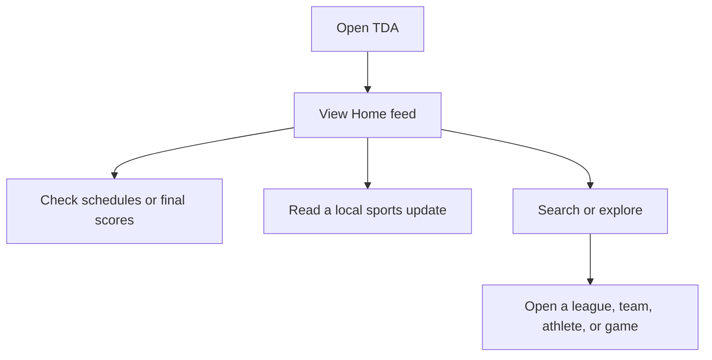
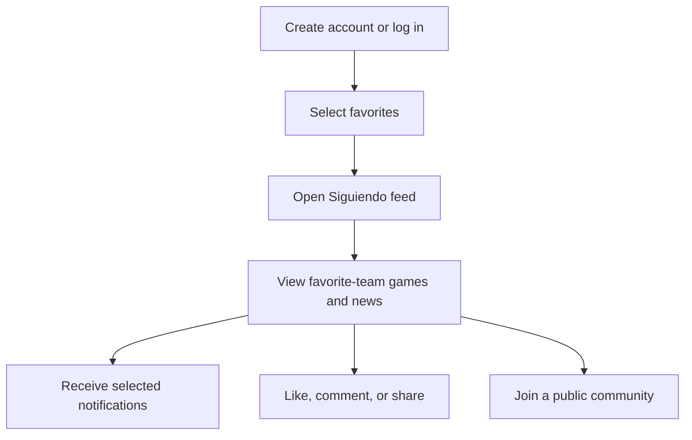
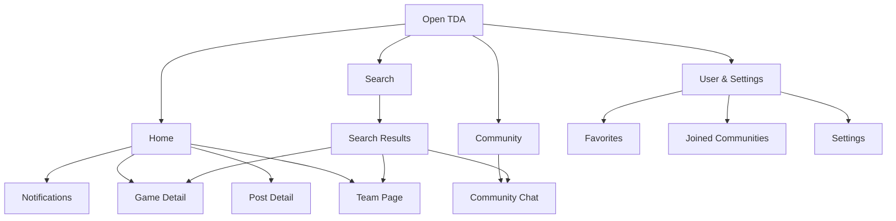
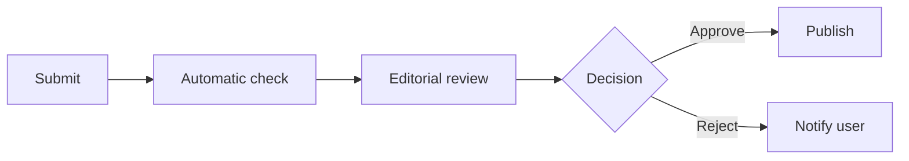

# Version 1 MVP Definition

## Overview

The first usable version of TDA will be a centralized Puerto Rico sports-information and fan-community application.

The MVP will solve the main problem identified during research: local sports information is distributed across social media pages, league websites, news platforms, team accounts, and older posts. TDA will organize this information into one mobile application where users can find verified schedules, final scores, team information, local sports news, and moderated public communities.

The official MVP includes Milestones 0 through 6:

1. Project planning and architecture
2. Technical foundation
3. Authentication, users, and onboarding
4. Admin system and sports data
5. Core sports-information experience
6. Notifications, engagement, and moderated communities

The MVP will focus on delivering reliable information and a clear user experience before introducing live scoring, advanced statistics, complex personalization, or unrestricted social-media features.

---

## MVP Goals

Version 1 should allow users to:

* Find Puerto Rico sports information in one place
* View upcoming game schedules
* View verified final scores
* Read local sports news and updates
* Find sports, leagues, teams, athletes, and communities
* Follow favorite sports, leagues, teams, and athletes
* Receive a feed based on their favorites
* Receive relevant notifications
* Interact with posts through likes and comments
* Join moderated public sports communities
* Manage their account and preferences

Version 1 should allow administrators to:

* Manage sports, leagues, teams, athletes, games, and scores
* Create and publish posts and articles
* Upload and manage images
* Send important notifications
* Create and manage public communities
* Review reports and moderate user activity

---

# Version 1 Navigation

TDA will use four primary tabs:

1. **Home**
2. **Community**
3. **Search**
4. **User & Settings**

Notifications will be accessed through the bell icon in the Home header instead of using a fifth navigation tab.

The four tabs should exist from the technical-foundation stage, even if they initially contain placeholder screens.

---

# Features Included in Version 1

## 1. Account Creation and Authentication

Users will be able to:

* Create an account
* Log in
* Verify their account
* Recover or change their password
* Maintain an authenticated session
* Log out
* Delete their account and associated data

Authentication will be managed through Clerk, while the NestJS backend will verify authentication tokens before allowing access to protected actions.

### Why It Was Selected

Accounts are required for favorites, personalized feeds, notifications, comments, community membership, and account settings. Authentication also provides the identity and access controls needed for safe community participation.

Public sports content should remain viewable without an account whenever possible. An account should only become necessary when a user wants to follow something, comment, receive personalized notifications, or participate in a community.

---

## 2. Initial Onboarding

After creating an account, users will complete a short onboarding sequence where they can select favorite:

* Sports
* Leagues
* Teams
* Athletes, when sufficient athlete data is available

Users should be able to change these selections later from the User & Settings tab.

### Why It Was Selected

Onboarding gives TDA the information needed to create a relevant experience without requiring an advanced recommendation algorithm.

It supports:

* The `Siguiendo` feed
* Favorite-team score cards
* Notification preferences
* Faster access to followed teams and leagues

The onboarding process should remain short so users can reach the application quickly.

---

## 3. Home Feed

The Home tab will be the main screen of the application.

It will include:

* Centered TDA logo
* Notification bell
* Favorite-team game carousel
* Scheduled-game cards
* Final-score cards
* `Siguiendo` and `Descubre` feed selector
* Text-only posts
* Image-based articles
* Post and article detail pages
* Links to teams, leagues, athletes, and games
* Native article sharing

### `Siguiendo`

The `Siguiendo` feed will show posts and updates connected to the sports, leagues, teams, and athletes followed by the user.

### `Descubre`

The `Descubre` feed will display general content from all sports and leagues currently supported by TDA.

The label `Descubre` should be used instead of `Para ti` during Version 1 because the application will not yet have enough user data to provide a true algorithmic recommendation system.

### Why It Was Selected

The Home feed provides an immediate summary of what is happening in Puerto Rico sports. It combines scores, schedules, news, and followed-team information so users do not need to search through several external platforms.

---

## 4. Local Sports News and Posts

Version 1 will support administrator-published content such as:

* Local sports articles
* Breaking-news updates
* Schedule announcements
* Final-score posts
* Team and league updates
* Game recaps
* Text-only posts
* Posts with images
* Links between posts and related sports entities

Content may be published with or without an image. This allows TDA to publish immediate text updates without requiring a graphic for every announcement.

### Why It Was Selected

Scores and schedules provide facts, but articles and posts provide context. Curated news helps TDA become a daily sports destination instead of only functioning as a scoreboard.

Restricting publishing to authorized administrators during Version 1 also reduces misinformation, spam, and content-moderation risks.

---

## 5. Favorite-Team Game Carousel

A horizontal section near the top of the Home feed will show games involving the user's favorite teams.

A game card may display:

* League
* Team names and logos
* Opponent
* Final score for completed games
* Date and time for upcoming games
* Game status
* Venue, when available
* Time since completion

Supported game states will include:

* Scheduled
* In progress
* Postponed
* Cancelled
* Final

An in-progress status may be displayed when verified, but Version 1 will not promise continuously updating partial scores.

### Why It Was Selected

Schedules and final scores are among the most frequently used features in a sports application. Placing them near the top of the Home feed gives users immediate value when they open TDA.

---

## 6. Game Schedules

Users will be able to view upcoming games by:

* Sport
* League
* Team
* Date

Schedule information may include:

* Participating teams
* Team logos
* Date
* Start time
* League
* Venue, when available
* Current game status

### Why It Was Selected

Schedules are a basic requirement for a sports application. They also support team pages, favorite-team cards, game reminders, and search results.

---

## 7. Final Scores

Completed games will display:

* League
* Date
* Team names and logos
* Verified final score
* Venue, when available
* Written recap, when available
* Related posts or articles

Only verified final scores will be published.

### Why It Was Selected

Final scores provide immediate value to fans who missed a game. They are also realistic for the MVP because they do not require the constant data connection and infrastructure needed for dependable live scoring.

---

## 8. Basic Game-Detail Page

Selecting a game will open a basic game-detail page.

The page may include:

* League information
* Date and venue
* Team names and logos
* Scheduled start time
* Game status
* Final score
* Basic written recap
* Related news and posts

Version 1 will not require play-by-play information, live statistics, advanced box scores, or video highlights.

### Why It Was Selected

The game-detail page gives schedules and final scores a complete destination. It also creates a foundation for adding statistics, highlights, and live information in future versions.

---

## 9. Search and Sports Discovery

The Search tab will allow users to search for:

* Sports
* Leagues
* Teams
* Athletes
* Games
* News and posts
* Communities

The default Search screen may include:

* Image-based sports categories
* Featured leagues
* Recent searches
* Horizontal featured posts
* Popular teams
* General discovery options

The initial search system will use PostgreSQL Full-Text Search.

### Why It Was Selected

Search directly addresses the problem of local sports information being difficult to find. It allows users to enter the application and quickly locate a specific team, league, athlete, game, article, or community.

The Search tab also replaces the previously proposed Sports tab by combining structured sports exploration with direct search.

---

## 10. Sport and League Directory

Users will be able to browse the sports and leagues supported by TDA.

A league page may include:

* League name and logo
* Participating teams
* Upcoming games
* Previous final scores
* Related news and posts

### Why It Was Selected

The directory gives the application a clear structure and allows users to explore Puerto Rico sports even if they do not already know what to search for.

---

## 11. Team Pages

Each supported team will have a basic page containing:

* Team name and logo
* League
* Follow or unfollow control
* Basic team information
* Upcoming schedule
* Previous final scores
* Basic roster information, when available
* Related posts and articles
* Link to the team's public community, when available

### Why It Was Selected

Many fans primarily follow a specific team. Team pages provide one organized place for information that would otherwise be distributed across team accounts, league pages, social media, and news websites.

---

## 12. Basic Athlete Pages

Basic athlete pages may include:

* Athlete name
* Profile image, when available
* Jersey number
* Position
* Current team
* Related posts

Full biographies, career histories, advanced statistics, awards, and historical performance are not required for Version 1.

### Why It Was Selected

Basic athlete pages make athletes searchable and improve team rosters without requiring the large amount of data needed for complete athlete profiles.

---

## 13. Favorites

Authenticated users will be able to follow or unfollow supported:

* Sports
* Leagues
* Teams
* Athletes

Favorite selections will affect:

* The `Siguiendo` feed
* The Home game carousel
* Notification preferences
* The User & Settings tab

### Why It Was Selected

Favorites provide useful personalization without requiring an advanced recommendation algorithm. They allow users to reach the information they care about more quickly.

---

## 14. Likes

Authenticated users will be able to like supported posts and articles.

Version 1 only requires a basic like and unlike action with a visible count.

### Why It Was Selected

Likes provide a simple form of engagement without introducing the complexity of reposts, follower systems, or unrestricted publishing.

---

## 15. Comments

Authenticated users will be able to comment on supported posts and articles.

Version 1 comments will include:

* Create a comment
* View comments
* Delete the user's own comment
* Report a comment
* Basic reply support
* Administrator moderation

### Why It Was Selected

Comments allow fans to discuss local sports content and increase engagement. They are included only with reporting and moderation controls because competitive research identified spam and toxic discussions as common problems in sports applications.

---

## 16. Native Sharing

Users will be able to share an article, post, team, or game using the mobile device's native sharing options.

### Why It Was Selected

Sharing helps users send sports information to friends and can increase awareness of TDA without requiring the application to build its own social-sharing network.

---

## 17. Notification Center

The notification screen will be accessed through the bell icon in the Home header.

It may include:

* Upcoming game reminders
* Game-start notifications
* Final-score notifications
* Schedule changes
* Breaking sports news
* Comment and reply activity
* Community activity
* Previous notifications

### Why It Was Selected

The notification center gives users one organized location for important updates and allows them to return to the related game, article, team, or community.

---

## 18. Push Notifications

Version 1 will support controlled push notifications for:

* Upcoming games
* Game starts
* Final scores
* Schedule changes
* Breaking news
* Comment replies
* Selected community activity

Users will be able to manage notification preferences.

### Why It Was Selected

Push notifications help users remain informed without constantly opening the application. Notification controls are necessary because competitive research shows that excessive or irrelevant notifications can damage the user experience.

---

## 19. User & Settings Tab

The User & Settings tab will include:

* Profile picture
* Display name
* Username
* Edit account information
* Favorite sports, leagues, teams, and athletes
* Joined communities
* Notification preferences
* Language settings
* Privacy and security settings
* About TDA
* Contact information
* Log out
* Delete account

The initial profile will remain private and functional. Version 1 will not include public follower counts, repost histories, or complete social profiles.

### Why It Was Selected

Users need one place to manage their account, favorites, communities, privacy, and notification preferences without turning the profile into a social-media page.

---

## 20. Basic Community Tab

The Community tab will introduce communication between Puerto Rico sports fans without creating a complete social network.

Version 1 will include:

* Joined-community list
* Browse public communities
* Search for communities
* Join and leave controls
* Administrator-created communities
* Public text messages
* Community names and logos
* Pinned administrator announcements
* Report messages
* Block and mute users
* Administrator moderation
* Basic community notifications

Version 1 will not include:

* User-created communities
* Private groups
* Private messages
* Message reactions
* Threaded conversations
* Search inside message history
* Community media uploads

### Why It Was Selected

Community participation is an important part of the complete TDA vision and differentiates the application from a traditional news website.

The first Community release will remain intentionally limited because real-time messaging introduces additional backend, moderation, privacy, and safety requirements.

---

## 21. Admin Dashboard

A protected web-based admin dashboard will allow authorized administrators to:

* Manage sports
* Manage leagues
* Manage teams
* Manage basic athlete information
* Manage schedules
* Manage game statuses
* Publish verified final scores
* Create and edit posts
* Upload post and entity images
* Publish and unpublish content
* Create and manage communities
* Review reports
* Moderate comments and messages
* Send important notifications

The admin dashboard will communicate with the NestJS API and will not connect directly to PostgreSQL.

### Why It Was Selected

The application depends on accurate and current sports information. The data-source research has not yet confirmed one reliable API that covers all required Puerto Rico sports and leagues.

The admin dashboard provides a controlled way to maintain the application's information while approved automated integrations are researched and developed.

---

## 22. User and Administrator Roles

Version 1 will define at least the following roles:

* Public visitor
* Authenticated user
* Moderator
* Content administrator
* System administrator

Protected actions will be verified by the backend.

### Why It Was Selected

Different permissions are required for publishing content, managing sports information, moderating communities, reviewing reports, and managing the application safely.

---

## 23. Content Verification and Moderation

Version 1 will include operational controls for:

* Recording the source of sports information
* Restricting publishing permissions
* Reviewing reported posts, comments, and messages
* Removing prohibited content
* Blocking or restricting abusive users
* Maintaining basic moderation records

Sports information should come from official leagues, teams, federations, or other approved and verified sources.

### Why It Was Selected

Accuracy and safety are core product principles. Users must be able to trust schedules and final scores, while comments and communities must have moderation before they become publicly available.

---

## 24. Spanish Interface

The first release will use Spanish as its primary interface language.

The application should establish consistent Spanish terminology for:

* Navigation
* Game statuses
* Notifications
* Favorites
* Communities
* Account settings
* Moderation actions

### Why It Was Selected

TDA is initially designed for Puerto Rico's local sports audience. Beginning with one language reduces development and testing work while allowing the team to establish a consistent product voice.

---

# Version 1 Data Strategy

Version 1 will initially support a limited number of Puerto Rico sports and leagues for which information can be obtained from official or verified sources.

The initial process should be:

1. Identify an official or verified source.
2. Confirm whether the information can be reused.
3. Enter or import teams, schedules, athletes, and results.
4. Review the information through the admin system.
5. Publish the verified information through the NestJS API.
6. Display the information in the mobile application.

The application should not depend entirely on unverified web scraping.

BeautifulSoup, Selenium, Playwright, or similar tools should only be considered after reviewing:

* Source reliability
* Terms of service
* Permission requirements
* Website structure
* Update frequency
* Long-term maintenance risk

Automated integrations should only be used when a stable API, approved feed, partnership, or permitted data-access method is available.

---

# Features Not Included in Version 1

| Feature                            | Reason for Exclusion                                                                    |
| ---------------------------------- | --------------------------------------------------------------------------------------- |
| Continuously updating live scores  | A reliable real-time data source has not been confirmed.                                |
| Play-by-play updates               | Requires continuous sport-specific data and additional game infrastructure.             |
| Live box scores                    | Depend on reliable real-time player and game data.                                      |
| Lock-screen Live Activities        | Depend on stable live scoring and additional native development.                        |
| Dynamic Island updates             | Depend on the Live Activities system and reliable live data.                            |
| League standings and rankings      | Require consistently updated competition rules and results.                             |
| Advanced team statistics           | Not necessary to prove the application's central value.                                 |
| Advanced athlete statistics        | Require detailed and consistent historical data.                                        |
| Complete athlete profiles          | Require biographies, statistics, histories, images, and continuous maintenance.         |
| Personalized discovery algorithm   | Version 1 will not have enough user-behavior data.                                      |
| Reposting                          | Requires public activity profiles and moves the app closer to a general social network. |
| Friends and followers              | Not required for users to find sports information or join communities.                  |
| Public social profiles             | Initial profiles will remain private and functional.                                    |
| Unrestricted user-created posts    | Create significant misinformation and moderation risks.                                 |
| Fan article submissions            | Require an editorial submission and approval workflow.                                  |
| User-created communities           | Increase spam, duplication, and moderation complexity.                                  |
| Private communities                | Introduce additional privacy and membership requirements.                               |
| Private messaging                  | Introduces additional safety and moderation risks.                                      |
| Community message reactions        | Not necessary for the first Community implementation.                                   |
| Threaded community replies         | Increase messaging and interface complexity.                                            |
| Search inside message history      | Requires additional search and message-indexing work.                                   |
| Community media uploads            | Increase storage costs and moderation risks.                                            |
| Stories                            | Do not improve the core scores, schedules, teams, and news experience.                  |
| Custom team-based interface themes | Visual personalization is not essential to the MVP.                                     |
| Dark mode                          | Version 1 will follow the established light-mode direction.                             |
| Complete English interface         | Spanish will be the initial product language.                                           |
| Video highlights and streaming     | Require content rights, partnerships, storage, and greater infrastructure.              |
| Injury reports                     | Reliable local injury information may not be consistently available.                    |
| Betting features                   | Do not support the application's primary purpose.                                       |
| Advertising system                 | The product should validate user value before introducing advertisements.               |
| Full Puerto Rico sports coverage   | The MVP will begin with a controlled selection of verifiable leagues.                   |

---

# Minimum User Flow

The minimum flow needed for a public user to receive value is:



The minimum flow for an authenticated user is:



A returning user's primary flow should be:

```text
Open TDA
→ View favorite-team schedules and final scores
→ Read relevant news
→ Open a team, game, article, or community
```

The user receives value as soon as they can find verified Puerto Rico sports information without searching through multiple external sources.

---

# Core Navigation Flow



---

# Features Saved for Future Versions

## Product Improvement Release

* Live scoring
* Basic team and player statistics
* Full athlete profiles
* League standings and rankings
* Digital-media and publisher pages
* Community message replies
* Community message reactions
* Search inside joined communities
* Popular searches
* Suggested communities
* Saved and bookmarked articles
* Improved notification controls
* Better sharing previews
* English interface
* Performance improvements
* Accessibility improvements based on testing

---

## Fan Contribution Release

* User-submitted article form
* Submission guidelines
* Draft and submitted states
* Automatic content checks
* Editorial review queue
* Approve and reject workflow
* Editor corrections
* Publish approved fan articles
* Submission-decision notifications
* Author attribution or alias selection

The publication workflow should be:



This controlled process is preferable to allowing users to publish content directly.

---

## Future and Experimental Features

* Personalized discovery algorithm
* Hide unwanted teams or topics
* Advanced statistics
* Custom team-page branding
* Stories
* Reposts
* Public social profiles
* Friends or follower system
* Unrestricted user-created posts
* User-created communities
* Private messaging
* Lock-screen Live Activities
* Dynamic Island updates
* More advanced live-game experiences
* Video highlights
* Redis caching
* BullMQ background jobs
* Infrastructure migration or expansion to AWS

These features should only be introduced after TDA has real users, reliable sports data, sufficient moderation capacity, and evidence that the features support the product's central purpose.

---

# MVP Success Criteria

Version 1 will be considered usable when a user can:

* Open the application and understand its four-tab navigation
* View verified Puerto Rico sports news
* Check upcoming schedules
* Check verified final scores
* Search for a supported sport, league, team, athlete, game, or community
* Open a league, team, athlete, or game page
* Create an account
* Select and manage favorites
* View a feed related to followed entities
* Receive and control notifications
* Like, comment on, and share content
* Join and participate safely in a public community
* Manage account and privacy settings
* Delete their account and associated data

Administrators must be able to:

* Manage supported sports, leagues, teams, and athletes
* Add and update schedules
* Publish verified final scores
* Create, edit, publish, and unpublish posts
* Upload and manage images
* Create and manage communities
* Review reports
* Moderate comments and messages
* Send important notifications

---

# Technical Foundation

Version 1 will use the selected technology stack:

* **Mobile:** React Native, Expo, and TypeScript
* **Backend:** NestJS
* **ORM:** Drizzle ORM
* **Database:** PostgreSQL
* **Authentication:** Clerk
* **Admin panel:** Protected web dashboard
* **Storage:** Cloudflare R2
* **Notifications:** Expo Notifications and Firebase Cloud Messaging
* **Hosting:** Railway
* **Search:** PostgreSQL Full-Text Search

Redis, BullMQ, AWS, and advanced search infrastructure will only be added when the application has a demonstrated technical requirement.

---

# Visual Scope

Version 1 will follow the established visual direction:

* Spanish-first interface
* Light mode only
* Inter typography
* White and light-gray backgrounds
* Red accent color
* Sharp rectangular cards and buttons
* Thin borders
* Minimal shadows
* Consistent icon library
* No emojis as interface icons
* Consistent `4:5` feed-image ratio

---

# Final MVP Decision

TDA Version 1 will be a centralized Puerto Rico sports-information and moderated fan-community application.

Its primary value will come from organizing verified final scores, schedules, team information, athlete information, local sports news, favorites, notifications, and public sports communities into one clear mobile experience.

The MVP will intentionally avoid continuously updating live scores, advanced analytics, unrestricted publishing, and complex social-network features until the team has validated its sports-data sources, administrative process, moderation capacity, technical foundation, and user demand.
