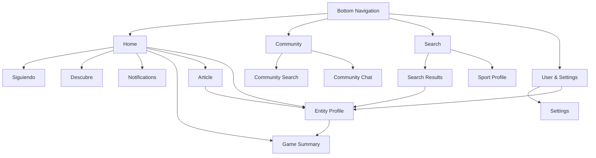

# Navigation Structure

## Four-Tab Order

1. Home
2. Community
3. Search
4. User & Settings

## Navigation Map

---

# Home

## Purpose

The Home tab is where users will find most of the platform’s content, especially vertically scrollable content such as posts, articles, future videos, and similar content.

Users will also see scores for their favorite teams and results from the leagues they follow. Notifications will be accessible through a bell icon in the header. These notifications may include updates about teams, leagues, and players.

The Home tab will include two sub-tabs:

- **Siguiendo:** Content related to the entities the user follows.
- **Descubre:** Broader content that is not limited to the entities the user follows.

When users are viewing one sub-tab, they will not see content from the other sub-tab.

## Sub-Pages Accessible from Home

- **Notifications:** Selecting the bell icon in the header will open the Notifications sub-page.

- **Game Summary:** Selecting a game score from the score carousel will open the Game Summary sub-page. Users can view the game summary, a description of what happened, the box score, and video highlights when supported.

- **Article:** Selecting an article, such as a post displaying “Ver más...,” will open the Article sub-page. It may include a headline or title, subheading, byline, main text, and conclusion when available.

- **Entity Profile:** Selecting an entity profile will open the corresponding Entity Profile sub-page. This may include a team, league, sport, player, athlete, author, or another entity. Users may select the entity that published the post or an entity mentioned within it.

## Header Actions

The Home header will display:

- The TDA logo in the center.
- A bell icon on the right for opening the Notifications sub-page.

---

# Community

## Purpose

The purpose of the Community tab is to promote conversations between fans. This feature will also help distinguish TDA from other sports apps by providing fans with a platform where they can communicate.

Users can join or leave any community at any time. Within a Community Chat, they can discuss whether they like or dislike a team, as long as they follow the guidelines, and react to messages.

In the future, users may be allowed to share GIFs or images provided by the platform. Direct image and video uploads will not be allowed for safety and storage reasons.

The primary purpose of this tab is to let users chat with other fans.

## Sub-Pages Accessible from Community

- **Community Search:** Selecting the magnifying-glass icon in the top-right corner will open the Community Search sub-page. This search will only display communities that users can join.

- **Community Chat:** Selecting a pinned Community Chat or a Community Chat from the main list will open that Community Chat sub-page.

## Community Tab Elements

- **Chat Editing:** A three-dot icon in the top-left corner will allow users to edit their Community Chats. Users can delete a Community Chat, which will also cause them to leave that community, or pin a Community Chat to the top.

- **Pinned Community Chats:** Similar to the iMessage app, pinned Community Chats will appear as circles at the top of the screen. A circular dashed outline with a plus sign will allow users to add a Community Chat to this section. Selecting a pinned Community Chat will open its Community Chat sub-page.

- **Community Chat List:** Community Chats will appear in a stacked list below the pinned Community Chats. Selecting one will open its Community Chat sub-page.

## Header Actions

The Community header will display:

- A three-dot icon on the left for editing Community Chats.
- The TDA logo in the center.
- A magnifying-glass icon on the right for opening the Community Search sub-page.

---

# Search

## Purpose

The purpose of the Search tab is to let users search for sports, leagues, teams, players, and athletes.

## Sub-Pages Accessible from Search

- **Entity Profile:** Selecting a sport, league, team, player, or athlete from the search results will open the corresponding Entity Profile sub-page.

- **Sport Profile:** Selecting one of the sport squares will open the corresponding Sport Profile sub-page.

## Search Tab Elements

- A search input that users can select to type and perform a search.
- Squares representing different sports.

## Header Actions

The Search header will display the TDA logo in the center. For now, it will not include icons on the left or right.

---

# User & Settings

## Purpose

The purpose of the User & Settings tab is to let users view or edit their account information and adjust their settings.

This tab will also display the user’s favorite teams and allow the user to remove teams they no longer want in their favorites.

## Sub-Pages Accessible from User & Settings

- **Settings:** Selecting the gear icon in the top-right corner will open the Settings sub-page. The available settings will be added later.

- **Entity Profile:** Selecting a favorite team, followed author, or followed sports page will open the corresponding Entity Profile sub-page.

## User & Settings Tab Elements

- **Profile Information:** Below the header, users will see their profile picture, username, and screen name. The username and screen name will be stacked next to the profile picture.

- **Profile Editing:** A pencil icon next to the username and screen name will allow users to change their screen name and profile picture. Changes to the username, email address, or password will be handled through the Settings sub-page.

- **Favorite Teams:** The user’s favorite teams will appear below the profile information in either a stacked layout or a carousel. Selecting a favorite team will open its Entity Profile sub-page.

- **Followed Authors and Sports Pages:** Followed authors and sports pages will appear below the favorite teams. Selecting one will open its Entity Profile sub-page.

- **Removing Favorites:** The Favorite Teams and Followed Authors and Sports Pages sections will each have a three-dot icon next to the section title. This icon will allow users to remove teams, authors, or sports pages from their favorites.

- **Contact Us:** A “Contact Us” button, or something similar, will appear at the bottom. Selecting it will open an email addressed to TDA’s contact email.

## Header Actions

The User & Settings header will display:

- The TDA logo in the center.
- A gear icon on the right for opening the Settings sub-page.

---

# General Navigation Behavior

## Nested-Screen Behavior

The header will remain visible on every tab and sub-page. When users open a sub-page, a back button will appear on the left side of the header.

The back button will return users through their navigation path in reverse. For example:

**Home → Article → Entity Profile**

Selecting the back button from the Entity Profile sub-page will return the user to the Article sub-page. Selecting it again will return the user to Home.

If users open only one sub-page from a tab, the back button will return them directly to that tab.

When navigating between tabs and sub-pages, the previous position and state should be preserved instead of refreshed.

## Bottom-Navigation Visibility

The bottom navigation will remain visible until the user begins scrolling. It may disappear after the user scrolls twice instead of disappearing immediately.

When the user scrolls back up, the bottom navigation will reappear.

## Back-Navigation Behavior

When users return from a single sub-page, the original tab should appear in the same state and position as before, without refreshing.

For a nested navigation path, the back button should move back one sub-page at a time. For example:

**Home → Entity Profile → Game Summary**

- The first selection of the back button returns the user to the Entity Profile sub-page.
- The second selection returns the user to Home.

This behavior should apply regardless of how many sub-pages the user opens.

## Notifications

Notifications will open through the bell icon in the Home header.

Notifications do not require a fifth tab because they are accessible directly from the Home header.

## Terminology

- **Tab:** One of the four primary navigation destinations: Home, Community, Search, or User & Settings.
- **Sub-tab:** A content section within a tab, such as Siguiendo or Descubre.
- **Sub-page:** Any dedicated page that is not one of the four main tabs.
- **Entity Profile:** A sub-page belonging to a sport, league, team, player, athlete, author, or another entity.
- **Community Chat:** The conversation area belonging to a community.