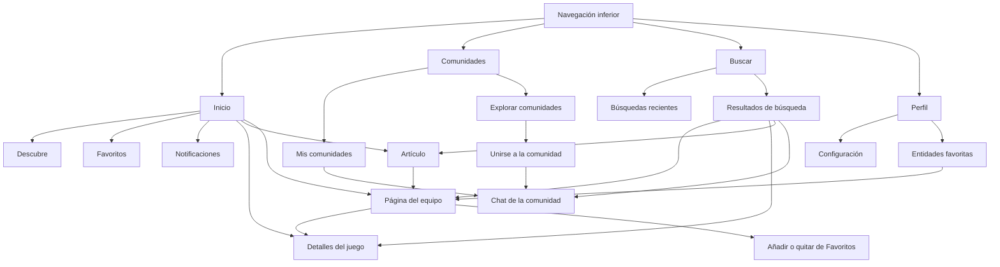

# Navigation Structure

## Four-Tab Order

The mobile application uses four primary tabs in this order:

1. **Inicio**
2. **Comunidades**
3. **Buscar**
4. **Perfil**

Notifications are accessed through the bell icon in the **Inicio** header and do not require a separate tab.

## Navigation Map

```mermaid
flowchart TD
    Navigation["Navegación inferior"]

    Navigation --> Home["Inicio"]
    Navigation --> Community["Comunidades"]
    Navigation --> Search["Buscar"]
    Navigation --> Profile["Perfil"]

    Home --> Discover["Descubre"]
    Home --> Favorites["Favoritos"]
    Home --> Notifications["Notificaciones"]
    Home --> GameDetails["Detalles del juego"]
    Home --> Article["Artículo"]
    Home --> TeamPage["Página del equipo"]

    Community --> MyCommunities["Mis comunidades"]
    Community --> ExploreCommunities["Explorar comunidades"]
    MyCommunities --> CommunityChat["Chat de la comunidad"]
    ExploreCommunities --> JoinCommunity["Unirse a la comunidad"]
    JoinCommunity --> CommunityChat

    Search --> RecentSearches["Búsquedas recientes"]
    Search --> SearchResults["Resultados de búsqueda"]
    SearchResults --> TeamPage
    SearchResults --> GameDetails
    SearchResults --> Article
    SearchResults --> CommunityChat

    Profile --> Settings["Configuración"]
    Profile --> FavoriteEntities["Entidades favoritas"]
    FavoriteEntities --> TeamPage

    Article --> TeamPage
    TeamPage --> GameDetails
    TeamPage --> FavoriteAction["Añadir o quitar de Favoritos"]
```

---

# Home

## Purpose

The Home tab is the primary destination for posts, articles, scheduled games, and verified final results.

Video content is Post-MVP and must not appear in the Version 1 navigation or interface. Version 1 also excludes live scoring and partially updated game results.

Users can access notifications through the bell icon in the header. Notifications may include:

- Final results
- Schedule changes
- Breaking news
- Selected community activity

The Home tab contains two content states:

- **Descubre:** Displays broader content that is not limited to the user’s favorite entities.
- **Favoritos:** Displays content associated with the user’s favorite sports, leagues, teams, and athletes.

The `01a-feed-filter-menu.png` wireframe documents the interaction used to switch between **Descubre** and **Favoritos**.

## Sub-Pages Accessible from Home

- **Notifications:** Selecting the bell icon opens the Notifications sub-page.

- **Game Details:** Selecting a scheduled game or verified final result opens the Game Details sub-page. This page may display the teams, date, time, venue, written recap, and basic game statistics when available. Advanced box scores and video highlights are Post-MVP.

- **Article:** Selecting an article or post displaying an action such as **Ver más...** opens the Article sub-page. The page may include a headline, subheading, byline, main text, and conclusion when available.

- **Team Page:** Selecting a team name, logo, or team-related search result opens the corresponding Team Page.

## Header Actions

The Home header displays:

- The TDA logo in the center.
- A bell icon on the right for opening Notifications.

---

# Notifications

## Purpose

The Notifications sub-page allows users to review approved Version 1 updates without adding a fifth navigation tab.

## Notification Categories

Version 1 may display notifications for:

- Final results
- Schedule changes
- Breaking news
- Selected community activity

Version 1 does not include notifications for:

- Live-score updates
- Comment replies
- Message reactions
- Saved publications
- Advanced statistics

## Navigation Behavior

Selecting a notification opens the related Version 1 destination when available, such as:

- Game Details
- Article
- Community Chat
- Team Page

The back button returns the user to Home.

---

# Game Details

## Purpose

The Game Details sub-page presents information about a scheduled or completed game.

The final and scheduled states are documented separately in:

- `03-game-detail-final.png`
- `03a-game-detail-scheduled.png`

## Scheduled Game State

A scheduled game may display:

- League
- Date and time
- Venue
- Team names and logos
- **Programado**, **Pospuesto**, or **Cancelado** status, when applicable

It must not display live or partially updated scoring.

## Final Game State

A completed game may display:

- League
- Date and venue
- Team names and logos
- Verified final score
- **Final** status
- Written game recap
- Basic game statistics

Version 1 does not include:

- Live scoreboards
- Video highlights
- Advanced player statistics
- Detailed box scores

## Navigation Behavior

Game Details may be opened from:

- Home
- Search Results
- Team Page

Selecting a team from Game Details may open the corresponding Team Page.

---

# Community

## Purpose

The Community tab provides public discussion spaces where fans can talk about Puerto Rico sports.

Users may join or leave a community at any time. Within Community Chat, users may send public text messages, view pinned administrator announcements, and report inappropriate messages.

Community-message reactions, threaded replies, private messages, and user-uploaded media are Post-MVP and must not appear in the Version 1 interface.

The Community tab contains two states:

- **Mis comunidades:** Displays communities the user has already joined.
- **Explorar:** Allows users to search for and join other public communities.

## Sub-Pages Accessible from Community

- **Community Chat:** Selecting a community from **Mis comunidades** opens its Community Chat.

- **Explore Communities:** Selecting **Explorar** displays public communities available to join.

- **Community Chat after joining:** Selecting **Unirse** adds the community to the user’s communities and allows the user to open its Community Chat.

## Community Tab Elements

- A **Buscar comunidades** field.
- A selector for **Mis comunidades** and **Explorar**.
- An **Abrir** action for joined communities.
- An **Unirse** action for communities the user has not joined.
- Community names and optional member or active-member counts.

## Community Chat Elements

Community Chat may include:

- Community name and identifying image
- Public text messages
- Pinned administrator announcements
- Text input
- Message-reporting controls
- **Unirse a la comunidad** when the user has not joined
- **Salir de la comunidad** when the user is already a member

## Header Actions

The Community header displays the TDA logo in the center. Back navigation appears when the user opens a Community Chat or another nested Community screen.

---

# Search

## Purpose

The Search tab allows users to search for:

- Sports
- Leagues
- Teams
- Athletes
- Games
- News
- Communities

The approved search placeholder is:

**Buscar deportes, ligas, equipos, atletas, juegos, noticias o comunidades**

## Search States

### Explore

The initial Search screen allows users to explore the approved Version 1 sports and leagues:

- Baloncesto — BSN
- Béisbol — LBPRC
- Voleibol femenino — LVSF
- Voleibol masculino — LVSM

### Recent Searches

When the user selects the search field, the screen may display:

- **Búsquedas recientes**
- An option to **Borrar todo**

Popular, numbered, ranked, and trending searches are Post-MVP.

## Search Results Navigation

Selecting a supported result opens the appropriate destination:

- Team result → Team Page
- Game result → Game Details
- News or article result → Article
- Community result → Community Chat or the appropriate joining state

Other supported sports, league, or athlete results may open their corresponding information page when that page is implemented and documented.

## Header Actions

The Search header displays the TDA logo in the center. It does not require additional icons on the left or right.

---

# Team Page

## Purpose

The Team Page provides the essential Version 1 information for a selected team.

It may be opened from:

- Home
- Search Results
- Game Details
- Favorite entities in Profile
- A team reference within an article

## Team Page Elements

The Team Page may display:

- Team logo
- Team name
- Sport and league
- Basic team information
- **Añadir a Favoritos** or **Quitar de Favoritos**
- **Próximos juegos**
- **Juegos anteriores**
- Team roster or basic athlete information
- Basic player statistics
- Related news and articles

## Team Page Actions

- Selecting **Añadir a Favoritos** adds the team to the user’s favorites.
- Selecting **Quitar de Favoritos** removes the team from the user’s favorites.
- Selecting an upcoming or previous game opens Game Details.
- Selecting related news or an article opens the Article sub-page.

## Version 1 Exclusions

The Team Page must not include:

- Live scoring
- League standings or rankings
- Advanced player statistics
- Complete scouting profiles
- Video highlights
- Social follower counts

---

# User & Settings

## Purpose

The User & Settings area is represented by the **Perfil** tab in the mobile interface.

This tab allows users to review or edit their profile, manage favorite entities, view their communities, and access account settings.

## Profile Options

Version 1 may include:

- **Editar perfil**
- **Equipos favoritos**
- **Ligas favoritas**
- **Mis comunidades**
- **Información de la cuenta**
- **Notificaciones**
- **Privacidad**
- **Seguridad**
- **Idioma**

Saved publications and a separate content-preferences system are not included in Version 1. Content personalization is based on the user’s favorite sports, leagues, teams, and athletes.

## Sub-Pages Accessible from Profile

- **Edit Profile:** Allows users to change supported profile information.

- **Favorite Entities:** Allows users to view or remove favorite sports, leagues, teams, and athletes.

- **Team Page:** Selecting a favorite team opens its Team Page.

- **My Communities:** Selecting a joined community opens its Community Chat.

- **Settings:** Selecting an account or configuration option opens the corresponding settings sub-page.

## Header Actions

The Profile header displays the TDA logo in the center. Nested settings pages display a back button on the left.

---

# General Navigation Behavior

## Nested-Screen Behavior

The header remains visible on each principal tab and sub-page. When users open a sub-page, a back button appears on the left side of the header.

The back button returns users through their navigation path in reverse.

For example:

**Buscar → Resultados de búsqueda → Página del equipo → Detalles del juego**

- The first selection of the back button returns the user to Team Page.
- The second selection returns the user to Search Results.
- The third selection returns the user to Search.

If users open only one sub-page from a tab, the back button returns them directly to that tab.

When navigating between tabs and sub-pages, the previous position and state should be preserved whenever practical.

## Bottom-Navigation Visibility

The bottom navigation provides access to:

- Inicio
- Comunidades
- Buscar
- Perfil

The active tab is visually identified in red.

The bottom navigation remains available on principal screens. Its behavior on nested screens should remain consistent across the application.

## Back-Navigation Behavior

When users return from a sub-page, the original tab should appear in its previous state and position without unnecessarily refreshing its content.

For nested navigation paths, the back button moves back one sub-page at a time.

## Notifications

Notifications open through the bell icon in the Home header.

Notifications do not require a fifth tab.

## Terminology

- **Tab:** One of the four primary navigation destinations: Inicio, Comunidades, Buscar, or Perfil.
- **State:** An alternate presentation of a screen, such as Descubre/Favoritos, scheduled/final Game Details, or Mis comunidades/Explorar.
- **Sub-page:** A dedicated page that is not one of the four primary tabs.
- **Team Page:** The dedicated page containing information about a selected team.
- **Entity page:** A page belonging to a supported sport, league, team, or athlete.
- **Community Chat:** The public conversation area belonging to a community.
- **Game Details:** The scheduled or completed game page containing verified information and, when available, a written recap and basic game statistics.

---

**Final navigation status:** The Navigation Structure reflects the nine principal Version 1 wireframes and three supporting interaction states. It includes the Team Page and excludes live scoring, video highlights, advanced box scores, message reactions, threaded replies, popular searches, and saved publications.