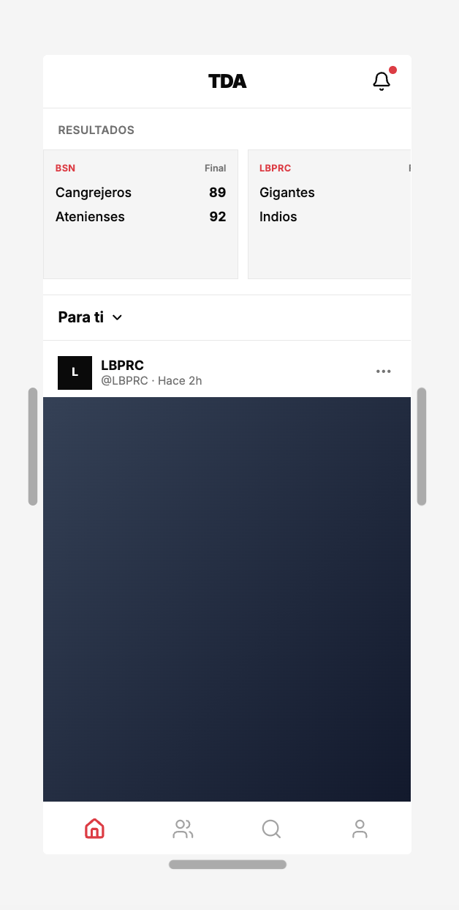
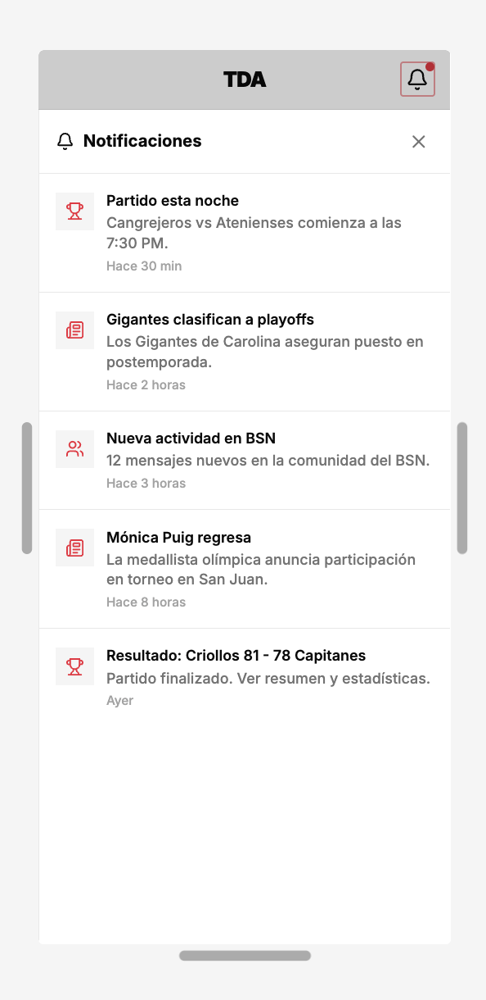
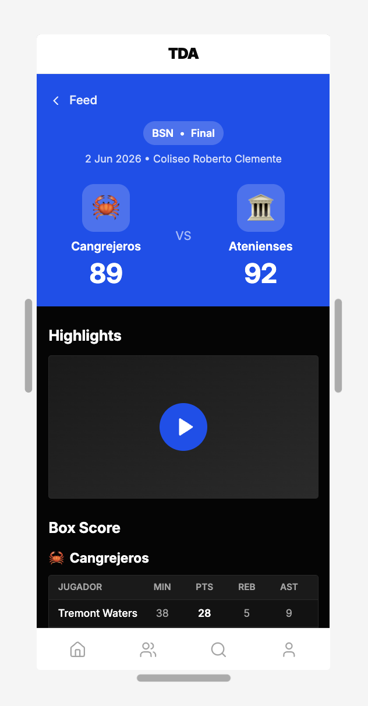
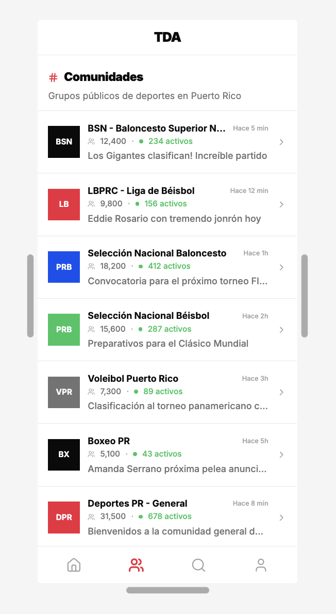
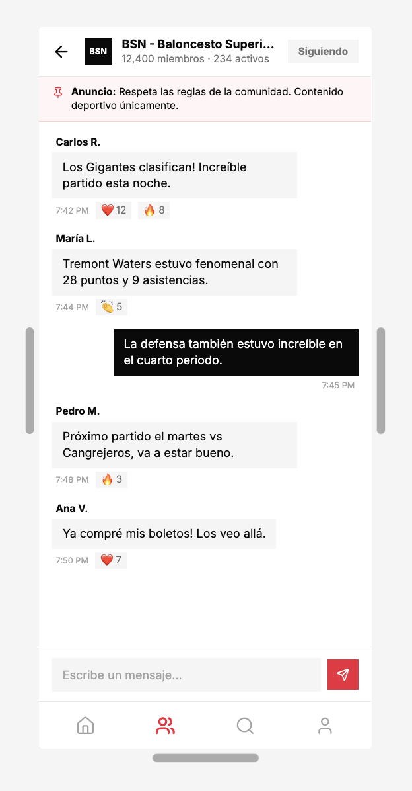
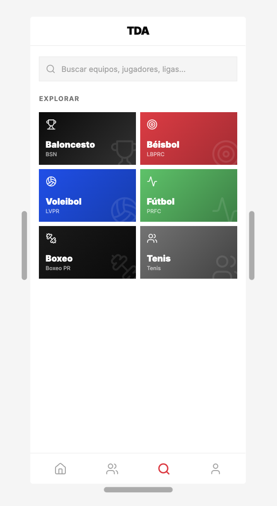
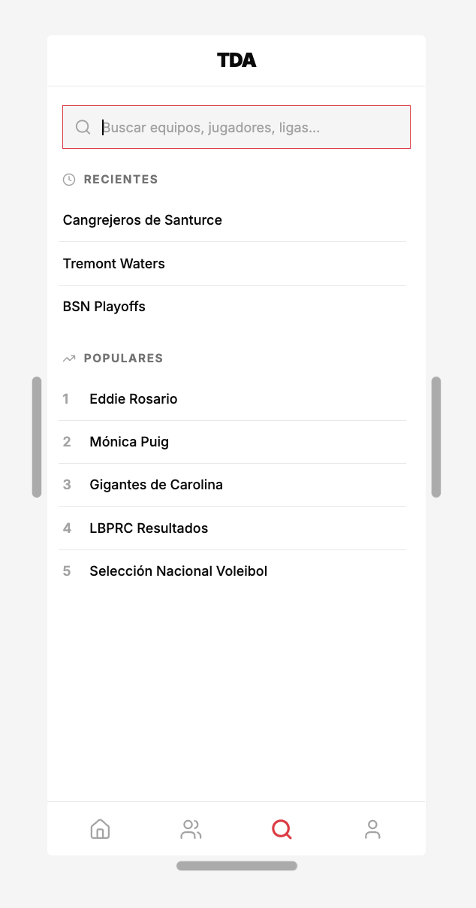
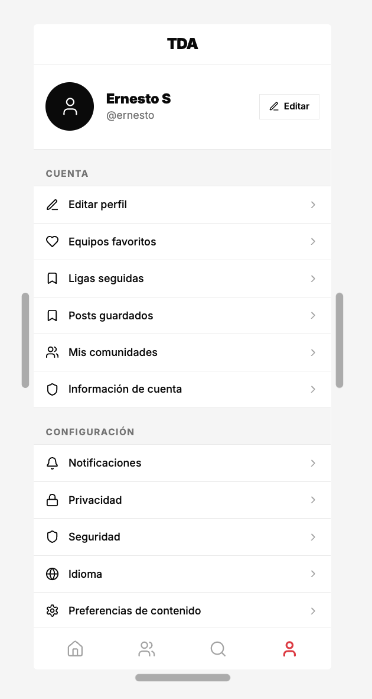
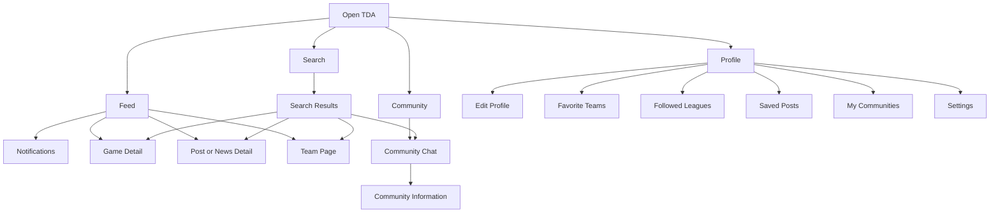

# Low-Fidelity Wireframes and Navigation Map

## Overview

These low-fidelity wireframes define the initial structure and navigation flow for TDA.

The wireframes are not intended to represent the final design. Their purpose is to establish the main screen layouts, content organization, and how users will move through the application before high-fidelity design and development begin.

---

## Main App Tabs

The main bottom navigation should contain four icon-only tabs:

* **Feed:** Home icon
* **Community:** Three-person icon
* **Search:** Magnifying-glass icon
* **Profile:** Person icon

The previously proposed Sports tab should be replaced by the Community tab.

Notifications should be accessed through the bell icon in the Feed header instead of appearing as a main navigation tab.

---

## Feed

The Feed should act as the main screen of the application.

It should include:

* Final scores
* Upcoming game information
* Notification bell
* **Para ti** and **Siguiendo** selector
* Sports news and posts
* Access to game details
* Access to team pages

---

## Notifications

The Notifications screen should be opened by selecting the bell icon in the Feed header.

It may include:

* Upcoming game reminders
* Final-score updates
* Sports news
* Community activity
* Previous notifications

---

## Game Detail

Selecting a finished game from the Feed should open the Game Detail screen.

It may include:

* League information
* Date and location
* Team names and logos
* Final score
* Game highlights
* Written recap
* Box score
* Player statistics
* Video highlights when available

Only final scores should be displayed. Partial or live scores should not be shown.

---

## Community

The Community tab should display public group chats related to Puerto Rico sports.

Each community may display:

* Community name
* Community image or abbreviation
* Member count
* Active-user count
* Recent activity
* Most recent message
* Related sport, league, or team

---

## Community Chat

Selecting a public community should open its group-chat screen.

The screen may include:

* Community name and image
* Member and active-user counts
* Follow or join button
* Pinned announcements
* Public messages
* Replies
* Reactions
* Message input
* Reporting and moderation options

No emojis should be used as interface icons. Reactions may eventually use a consistent custom reaction system.

---

## Search Explore

The Search tab should allow users to discover content throughout the application.

Users should be able to search for:

* Teams
* Players
* Leagues
* Sports
* Games
* News
* Communities

The default Search screen may include image-based categories for the main sports and leagues.

---

## Search Activity

When the user selects the search field, the screen may display:

* Recent searches
* Popular searches
* Trending teams
* Trending athletes
* Popular leagues
* Current sports topics

---

## Profile and Settings

The Profile tab should contain the user’s account information and application settings.

It may include:

* Profile picture
* Name and username
* Edit-profile button
* Favorite teams
* Followed leagues
* Saved posts
* Community memberships
* Account information
* Notification settings
* Privacy
* Security
* Language
* Content preferences

---

## Team Page

A dedicated Team Page wireframe still needs to be created.

The Team Page may include:

* Team name and logo
* League
* Team record
* Upcoming schedule
* Previous results
* Roster
* Player statistics
* Team news
* Related posts
* Link to the team’s community

---

## Navigation Map

---

## Main User Flows

### Feed to Notifications

`Feed → Bell icon → Notifications`

### Feed to Game Details

`Feed → Select final score → Game Detail`

### Feed to Team Page

`Feed → Select team name or logo → Team Page`

### Search to Team Page

`Search → Enter team name → Select result → Team Page`

### Search to Game Details

`Search → Find game → Select result → Game Detail`

### Search to Community

`Search → Find community → Select result → Community Chat`

### Community Navigation

`Community → Select public group → Community Chat`

### Profile Navigation

`Profile → Select account or setting option → Selected page`

---

## Current Wireframe Status

The current wireframes cover:

* Feed
* Notifications
* Game details
* Community list
* Community chat
* Search exploration
* Search activity
* Profile and settings

The Team Page still needs to be added to fully complete the planned main-screen wireframes.

---

## Final Direction

These wireframes should be used as the initial structural reference for TDA.

The layouts may change during testing and high-fidelity design, but the main navigation should remain focused on:

* Feed
* Community
* Search
* Profile
