# Low-Fidelity Wireframes and Navigation Map

## Overview

These low-fidelity wireframes define the initial structure and navigation flow for TDA.

The wireframes are not intended to represent the final design. Their purpose is to establish the main screen layouts, content organization, and how users will move through the application before high-fidelity design and development begin.

The screen descriptions and navigation terminology in this document follow the approved TDA Spanish Product Glossary.

> **Visual implementation status:** The eight original wireframes were revised to match the approved Version 1 scope and Spanish terminology. A ninth principal wireframe, Página del equipo, was added. The final set contains nine principal wireframes and three supporting interaction states.

## Final Wireframe Set

| # | Wireframe | File | Type |
|---|---|---|---|
| 1 | Inicio | `01-feed-home.png` | Principal |
| 1A | Selector Descubre/Favoritos | `01a-feed-filter-menu.png` | Supporting state |
| 2 | Notificaciones | `02-notifications.png` | Principal |
| 3 | Detalles del juego — Final | `03-game-detail-final.png` | Principal |
| 3A | Detalles del juego — Programado | `03a-game-detail-scheduled.png` | Supporting state |
| 4 | Mis comunidades | `04-community-my-communities.png` | Principal |
| 4A | Explorar comunidades | `04a-community-explore.png` | Supporting state |
| 5 | Chat de la comunidad | `05-community-chat.png` | Principal |
| 6 | Buscar — Explorar | `06-search-explore.png` | Principal |
| 7 | Búsquedas recientes | `07-search-recent.png` | Principal |
| 8 | Perfil y configuración | `08-profile-settings.png` | Principal |
| 9 | Página del equipo | `09-team-page.png` | Principal |

---

## Main App Tabs

The main bottom navigation should contain four icon-only tabs with the following approved user-facing labels:

* **Inicio:** Home icon
* **Comunidades:** Three-person icon
* **Buscar:** Magnifying-glass icon
* **Perfil:** Person icon

The previously proposed Sports tab should be replaced by the **Comunidades** tab.

**Notificaciones** should be accessed through the bell icon in the **Inicio** header instead of appearing as a main navigation tab.

---

## Inicio

**Inicio** should act as the main screen of the application.

It should include:

* Final scores
* Upcoming game information
* Notification bell
* **Descubre** and **Favoritos** selector
* Sports news and publications
* Access to game details
* Access to team pages

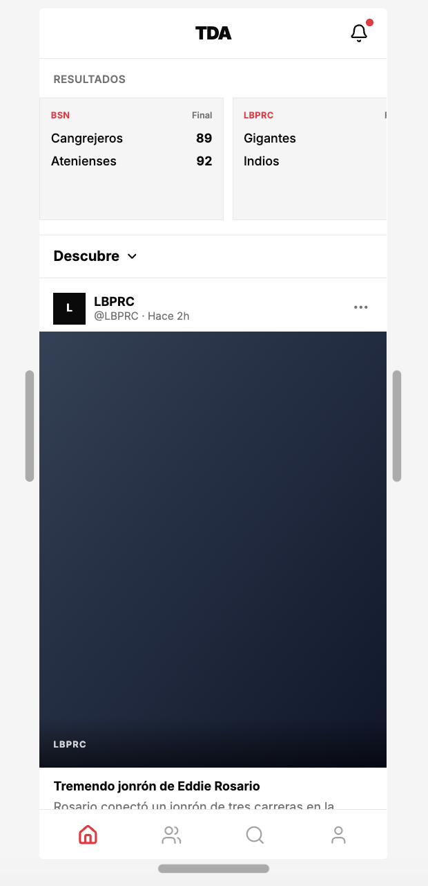

### Supporting State — Selector Descubre/Favoritos

The selector allows users to switch between the general **Descubre** feed and content related to their **Favoritos**.

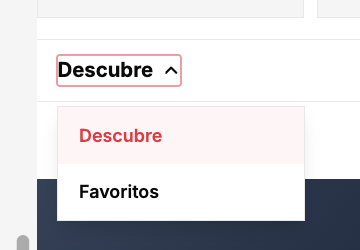

---

## Notificaciones

The **Notificaciones** screen should be opened by selecting the bell icon in the **Inicio** header.

It may include:

* Upcoming game reminders
* Final-result updates
* Schedule changes
* Sports news
* Community activity
* Previous notifications

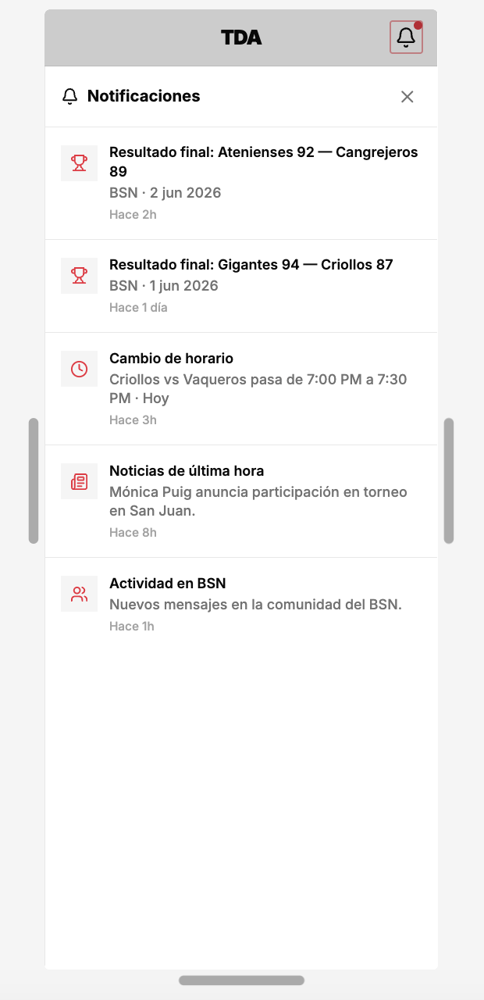

---

## Detalles del juego

Selecting a scheduled or completed game from Inicio or Página del equipo should open the Detalles del juego screen.

The MVP screen may include:

* League information
* Date and location
* Team names and logos
* Final score
* Written game recap
* Basic game statistics
* Related publications or articles

Only final scores should be displayed. Partial or live scores should not be shown.

### Post-MVP Considerations

The following elements are not included in the approved MVP:

* Advanced game statistics or detailed box scores
* Game and video highlights
* Live or in-progress scoring

### Final Game

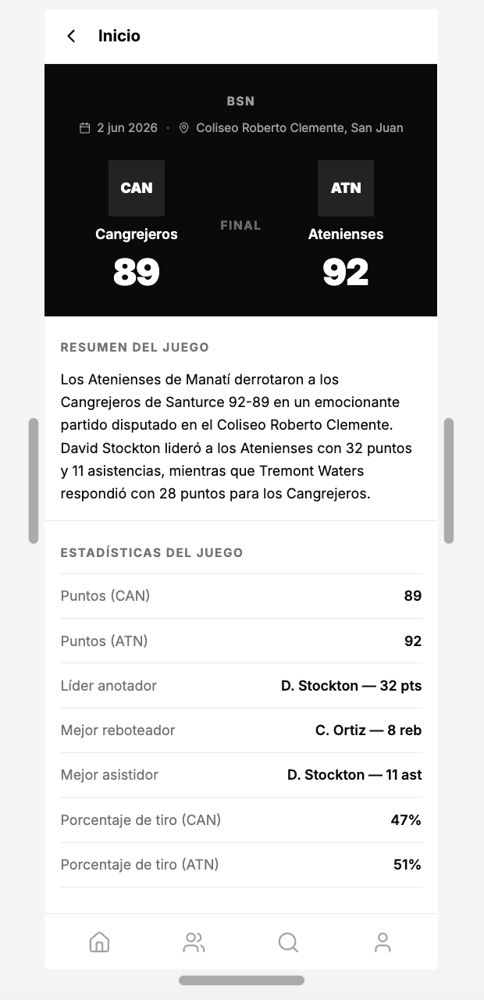

### Supporting State — Scheduled Game

The scheduled state displays verified date, time, venue, teams, and the **Programado** status without presenting live information.

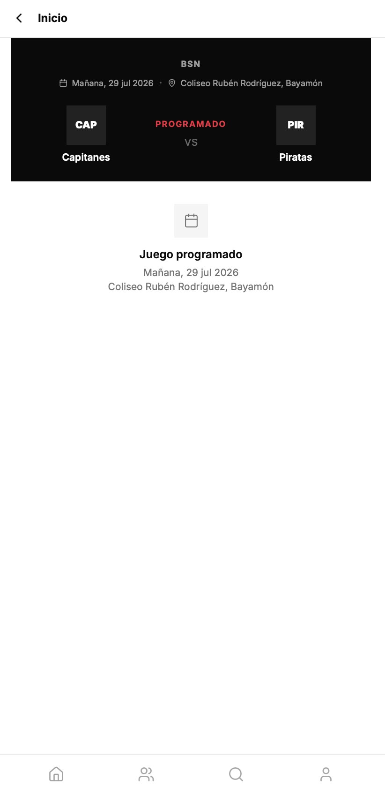

---

## Comunidades — Mis comunidades

The **Comunidades** tab should display public communities related to Puerto Rico sports.

Each community may display:

* Community name
* Community image or abbreviation
* Member count
* Active-member count
* Recent activity
* Most recent message
* Related sport, league, or team

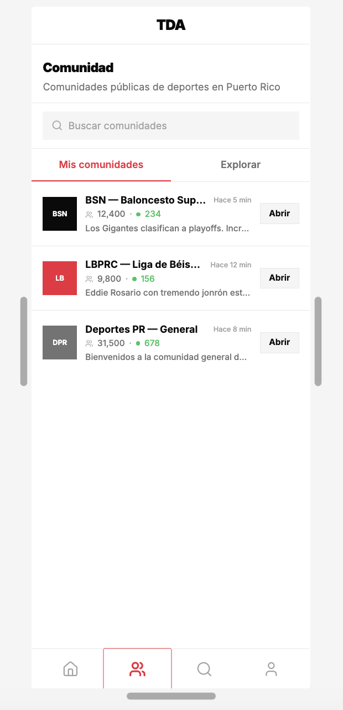

### Supporting State — Explorar comunidades

The **Explorar comunidades** state allows users to search for public communities and join communities they have not joined.

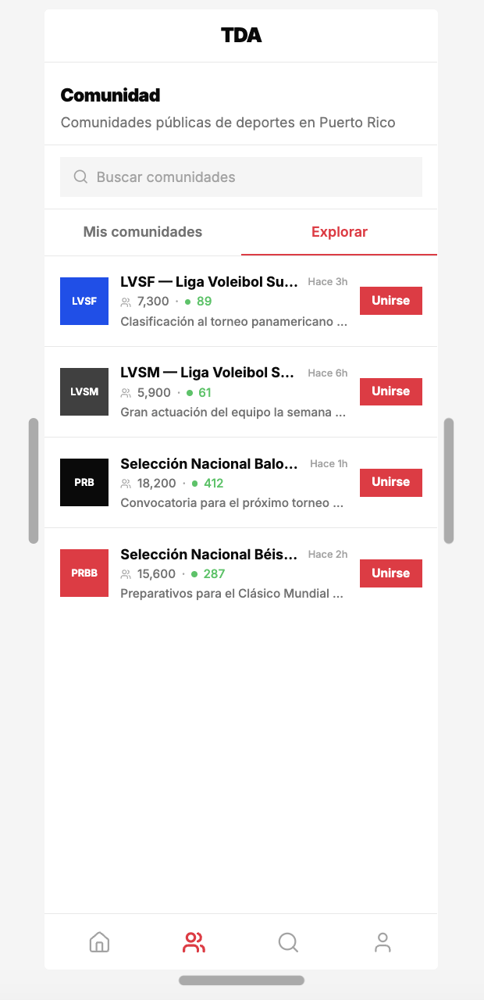

---

## Chat de la comunidad

Selecting a public community should open its group-chat screen.

The MVP screen may include:

* Community name and image
* Member and active-member counts
* **Unirse a la comunidad** or **Salir de la comunidad** button
* Pinned announcements
* Public messages
* Message input
* Reporting and moderation options

### Post-MVP Considerations

The following elements are not included in the approved MVP:

* Threaded replies inside community chats
* Community message reactions

No emojis should be used as interface icons or as replacements for interface labels.

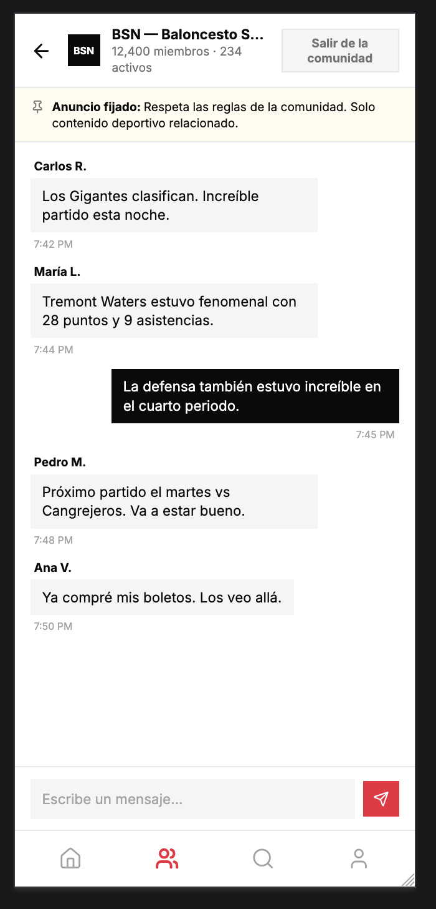

---

## Buscar — Explorar

The **Buscar** tab should allow users to discover content throughout the application.

Users should be able to search for:

* Sports
* Leagues
* Teams
* Athletes
* Games
* News and publications
* Communities

The default **Buscar** screen may include image-based categories for the main sports and leagues.

The approved search-field placeholder is:

**Buscar deportes, ligas, equipos, atletas, juegos, noticias o comunidades**

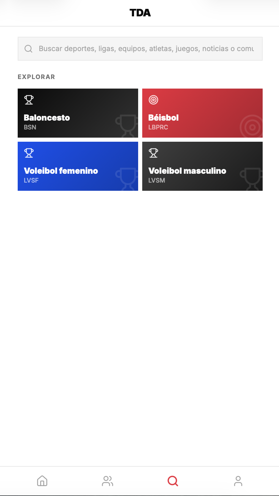

---

## Buscar — Búsquedas recientes

When the user selects the search field, the screen displays only the user’s recent searches and an option to clear the search history.

Popular and trending searches are reserved for a future release.

### Post-MVP Considerations

**Búsquedas populares** are not included in the approved MVP and may be considered for a future release.

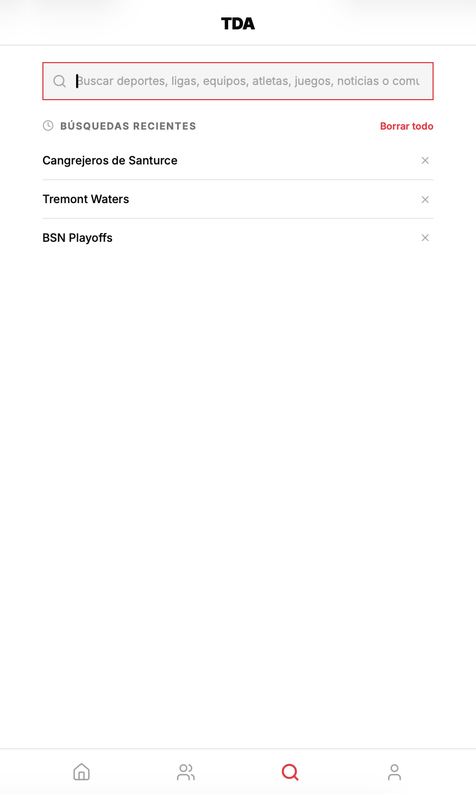

---

## Perfil y configuración

The **Perfil** tab should contain the user’s profile information and application settings.

The MVP screen may include:

* Profile picture
* Name and username
* Edit-profile button
* Favorite teams
* Favorite leagues
* Favorite sports
* Favorite athletes
* Community memberships
* Account information
* Notification preferences
* Privacy
* Security
* Language
* **Administrar Favoritos**

Version 1 content personalization should be managed through the user’s Favorites. A separate content-preferences system should not be included.

### Post-MVP Considerations

The following element is not included in the approved MVP:

* Saved publications

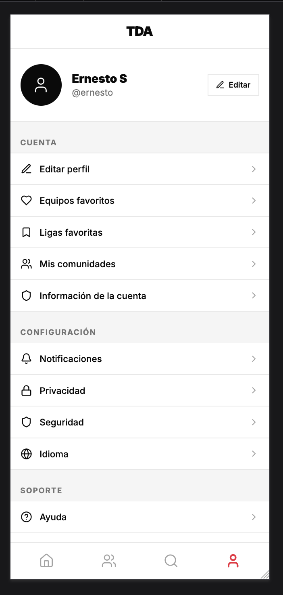

---

## Página del equipo

The **Página del equipo** should provide centralized information about a selected team.

The MVP screen should include:

* Team name and logo
* League
* **Añadir a Favoritos** or **Quitar de Favoritos**
* Team record
* Próximos juegos
* Juegos anteriores
* Team roster
* Basic athlete statistics
* Team news
* Publicaciones relacionadas
* Access to the team’s related community

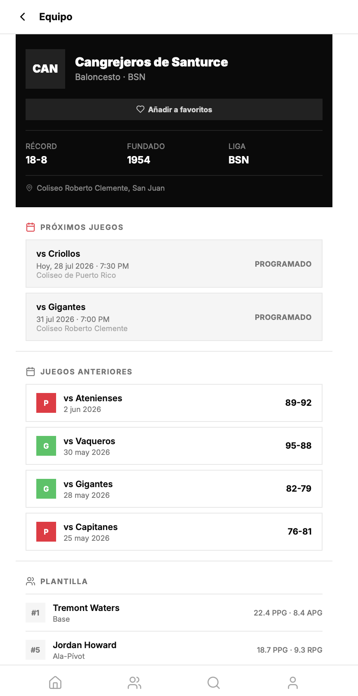

---

## Navigation Map

```mermaid
flowchart TD
    Nav["Navegación principal"] --> Inicio
    Nav --> Comunidades
    Nav --> Buscar
    Nav --> Perfil

    Inicio --> Notificaciones
    Inicio --> Juego["Detalles del juego"]
    Inicio --> Equipo["Página del equipo"]

    Comunidades --> MisComunidades["Mis comunidades"]
    Comunidades --> Explorar["Explorar comunidades"]
    MisComunidades --> Chat["Chat de la comunidad"]
    Explorar --> Chat

    Buscar --> Recientes["Búsquedas recientes"]
    Buscar --> Resultados["Resultados de búsqueda"]
    Resultados --> Equipo

    Equipo --> Juego
    Equipo --> Favoritos["Añadir o quitar de Favoritos"]